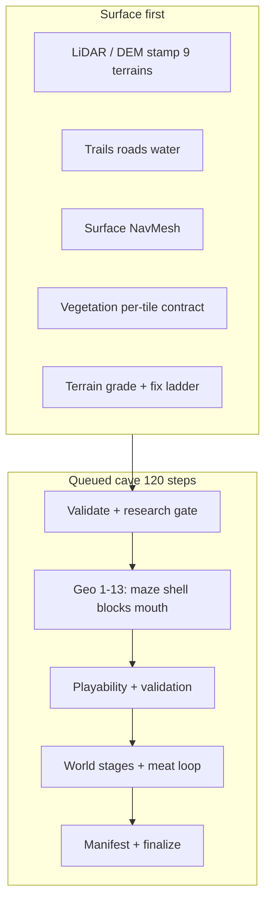

# Environment Authoring Kit

**`com.cursor.environment-authoring-kit`** — Unity Editor package for **procedural Florida karst surface + lava-tube cave worlds**, quality grading, and optional **Cursor SDK** automation. Built for **Unity 6 (6000.x)**, **URP**, and **XR** (VITURE profile).

| | |
|--|--|
| **Unity** | 6000.0+ |
| **Rendering** | Universal Render Pipeline 17+ |
| **XR** | `com.unity.xr.management` 4.5+ |
| **Node (optional)** | 18+ for `Tools/cave-grader` |
| **License** | [Educational use free; commercial requires license](LICENSE.md) — see [Research attribution](docs/RESEARCH_DATA_ATTRIBUTION.md) for geospatial data |

---

## Install

Add to your project's `Packages/manifest.json`:

```json
{
  "dependencies": {
    "com.cursor.environment-authoring-kit": "file:Packages/com.cursor.environment-authoring-kit"
  }
}
```

Or publish to a Git URL / registry and reference that package name. Open the project in Unity and let scripts compile.

**Hub reference project:** this package is developed against a sample Unity repo that uses `Assets/EnvironmentKit/` for generated artifacts and `ResearchCache/`. Your game can use the same layout or retarget paths via `CaveBuildCursorSettings`.

---

## Quick start

1. Open your cave scene (e.g. `MainScene`).
2. Tag or assign a **Ground** anchor (terrain or mesh) — the kit resolves `SceneGroundInfo` from it.
3. Place **`PortalFive`** for the cave entrance (not the shop portal).
4. Open **Window → Environment Kit → Hub** (recommended), then run build actions from Hub.
5. Watch **Window → Environment Kit → Cave Build → Diagnostics → Pipeline Console** until step **120/120** completes.
6. Optional: **Cave Build Grader** for letter grade and failing stages.

If a previous build left only a **ramp / mouth patch** without tunnels, run **Cave Build → Advanced → Build Complete Cave — Full AAA Rebuild (invalidate ladder)**.

---

## Build menus

All under **Window → Environment Kit**:

| Menu | Scope | What it does |
|------|--------|----------------|
| **Build Complete Cave Level (Active Scene)** | `FullWorld` | **Terrain-first:** 9-tile surface, trails, NavMesh, dense vegetation, then **120-step** cave pipeline |
| **Build Surface World Only (Active Scene)** | `SurfaceOnly` | Surface + terrain ladder only — no underground geometry |
| **Build Cave Only — Align to Surface (Active Scene)** | `CaveOnly` | Underground only; mouth aligns to existing `GeneratedSurfaceWorld` |
| **Rebuild Complete Cave (MainScene)** | `FullWorld` | Opens MainScene and runs full build |
| **Build Complete Cave — Full AAA Rebuild (invalidate ladder)** | `FullWorld` | Clears incremental ladder cache; forces full geo + surface |
| **Build Layout Prototype (Interview)** | prototype | Fast maze preview — not shipping quality |
| **Terrain Build Grader** / **Re-grade Only** | surface | Surface terrain ladder scores |
| **Cave Build Grader** | cave | Quality report, export prompts, invoke agent |

Diagnostics, repair, and emergency: **Cave Build → Diagnostics/** (unfreeze editor, invalidate ladder, purge stale prompts, etc.).

---

## FullWorld pipeline order



**Rules:**

- Cave **geometry steps 1–13** always run when the scene lacks a **full** cave (block tunnel, or `RouteTerrainFloor` + `RouteTerrainCeiling`, or spline tube) — incremental ladder cannot skip them for a ramp-only partial.
- Terrain mouth fixes **do not** synthesize underground layout; they require real route mesh from geo.
- Surface props use a **per-tile density contract** on all locked terrains (see [docs/REQUIREMENTS.md](docs/REQUIREMENTS.md)).

Details: [docs/WORLD-GENERATION-PIPELINE-LADDER.md](docs/WORLD-GENERATION-PIPELINE-LADDER.md), [docs/SURFACE-WORLD-BUILD.md](docs/SURFACE-WORLD-BUILD.md), [docs/PHASE_CONTRACTS.md](docs/PHASE_CONTRACTS.md).

---

## Key code locations

| Area | Path |
|------|------|
| Build entry | `Editor/Blockout/LavaTubeCaveBuilder.cs` |
| Startup (surface → cave) | `Editor/Blockout/CaveBuildStartupCoordinator.cs` |
| Queued pipeline (120 steps) | `Editor/Blockout/CaveBuildQueuedPipelineSchedule.cs`, `LavaTubeCaveBuildPipeline.Queued.cs` |
| Phase contracts / ladder | `Editor/Blockout/CaveBuildPhaseContractRegistry.cs` |
| Surface world | `Editor/Blockout/SurfaceWorldGenerator.cs`, `SurfaceTerrainAiPhases.cs` |
| Surface props | `Editor/Blockout/SurfaceIntelligentPropPlacer.cs`, `SurfaceTerrainPropPlacementRegion.cs` |
| Cursor bridge | `Editor/Blockout/CaveBuildCursorAgentBridge.cs` |
| Editor pacing | `Editor/Blockout/CaveBuildActionPacing.cs` |
| Runtime cave | `Runtime/Cave/` |
| Node grader | `Tools/cave-grader/` |

---

## Cursor grader (Node)

```bash
cd Packages/com.cursor.environment-authoring-kit/Tools/cave-grader
cp .env.example .env    # CURSOR_API_KEY=... (+ optional GOOGLE/ANTHROPIC/OPENAI/OPENROUTER/CUSTOM keys), HUB_ROOT=...
npm install
npm run doctor
./run-grade-and-fix.sh --auto --stream
```

Full setup: [docs/CaveGradingAndCursor.md](docs/CaveGradingAndCursor.md).

---

## Research cache

Curated proven sources under `Assets/EnvironmentKit/ResearchCache/` (in your Unity project). Agents read disk **before** web search.

| Command | Purpose |
|---------|---------|
| `npm run sync-research-pull` | Full pull — cache + missing images + FL hillshades |
| `npm run sync-research-cache` | Refresh metadata; reuse valid PNGs |
| `npm run sync-florida-hillshades` | County hillshade PNGs only |

Every **Build Complete Cave** triggers `SyncFullResearchPull` in the editor when configured. **Florida policy:** cave structure from LiDAR / karst GIS only — not water table, TDS, or bathymetry.

Credits: [docs/RESEARCH_DATA_ATTRIBUTION.md](docs/RESEARCH_DATA_ATTRIBUTION.md).

---

## Generated artifacts

Written under `Assets/EnvironmentKit/Generated/` (regenerable; often gitignored):

| File | Purpose |
|------|---------|
| `CaveBuildQualityReport.json` | Letter grade, dud reasons, `buildAcceptable` |
| `CaveBuildLiveRunStatus.md` | Live pipeline step / phase |
| `SurfacePropPlacementPlan_*.json` | Per-category placement plans |
| `SurfacePropTerrainLock.json` | Locked 9-tile region for scatter |
| `CaveBuildRouteProbe.json` | Underground walkability probe |
| `CaveBuildPhaseContracts.json` | Ladder rung I/O export |

Persistent (typically committed): `Assets/EnvironmentKit/ResearchCache/`, `Recipes/`, `Presets/`.

---

## Documentation

| Doc | Content |
|-----|---------|
| [docs/README.md](docs/README.md) | Package documentation index |
| [docs/REQUIREMENTS.md](docs/REQUIREMENTS.md) | Functional requirements & acceptance (package) |
| [CHANGELOG.md](CHANGELOG.md) | Package version history |
| [docs/CaveGradingAndCursor.md](docs/CaveGradingAndCursor.md) | Grading, Cursor workflows |
| [docs/AAA-PROCEDURAL-CAVE-PIPELINE.md](docs/AAA-PROCEDURAL-CAVE-PIPELINE.md) | Autonomous pipeline design |
| [docs/COMMERCIAL-PRODUCTION-GRADING.md](docs/COMMERCIAL-PRODUCTION-GRADING.md) | Ship / Beta tiers |

If you use the Hub sample repo, also see the repo root `REQUIREMENTS.md` and `docs/CHANGELOG.md`.

Publishing this package: [docs/PUBLISHING.md](docs/PUBLISHING.md).

---

## License

Original **C# and TypeScript** in this package (excluding `Tools/cave-grader/node_modules`) is under **[LICENSE.md](LICENSE.md)** — free for educational and personal non-commercial use; **commercial use requires a separate license** from the copyright holder.

Government and open geospatial data in the research cache remain under their provider terms — see [docs/RESEARCH_DATA_ATTRIBUTION.md](docs/RESEARCH_DATA_ATTRIBUTION.md).

---

## Version

See `package.json` (current: **0.2.0**).
