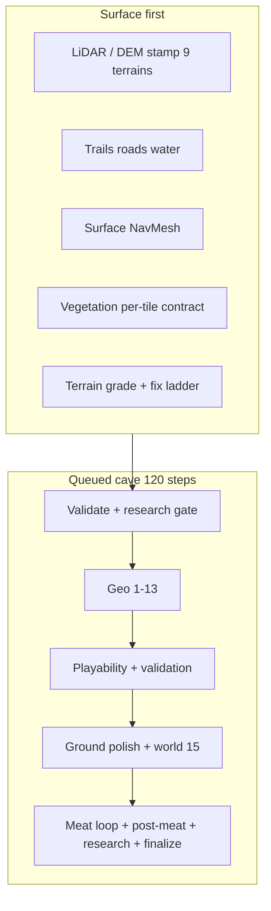

# Environment Authoring Kit

**`com.cursor.environment-authoring-kit`** — Unity Editor package for **procedural Florida karst surface + lava-tube cave worlds**, quality grading, and optional **Cursor SDK** automation.

Built for **Unity 6 (6000.x)** and **URP**. XR support = **editor optimization profile + Unity XR packages** in the consumer project — **not** a bundled VITURE SDK or glasses-ready demo.

> **Public GitHub clone?** Read the consuming repo’s **[docs/PUBLIC_REPO_SCOPE.md](../../docs/PUBLIC_REPO_SCOPE.md)** first — scenes, store art, `Generated/`, and `ResearchCache/` are **not** in git.

| | |
|--|--|
| **Unity** | 6000.0+ |
| **Rendering** | Universal Render Pipeline 17+ |
| **XR** | Configure OpenXR / device SDK in **your** project; kit applies `VitureXRPro` **budget** preset when present |
| **Node** | 18+ + `npm install` in `Tools/cave-grader` (required for FullWorld preflight) |
| **Version** | **0.3.0** — see `package.json` |
| **License** | [LICENSE.md](LICENSE.md) — **educational/personal non-commercial free**; **commercial use requires license or purchase from copyright holder** (not CC0) |

---

## Install

Add to your project's `Packages/manifest.json`:

```json
{
  "dependencies": {
    "com.cursor.environment-authoring-kit": "file:Packages/com.cursor.environment-authoring-kit"
  }
}
```

Or publish to a Git URL / registry. Open the project in Unity and let scripts compile.

**Expected project layout** (Hub / sample layout):

| Path | Role |
|------|------|
| `Assets/EnvironmentKit/Presets/` | ScriptableObjects (atmosphere, scatter, **VitureXRPro**) — committed in public repo |
| `Assets/EnvironmentKit/Recipes/` | JSON build recipes — committed |
| `Assets/EnvironmentKit/Generated/` | Regenerated each build — **gitignore** |
| `Assets/EnvironmentKit/ResearchCache/` | Local research pull — **gitignore** |
| Your `Assets/` art | **You** provide licensed prefabs; kit scans when configured |

---

## Required before first build (public clone)

FullWorld runs **preflight** first. Missing requirements → build blocked → see `Assets/EnvironmentKit/Generated/CaveBuildPreflightReport.md` (rows marked **BLOCK**).

| Required | Detail |
|----------|--------|
| Scene + **`Ground`** tag | Walkable anchor for terrain/cave |
| **`PortalFive`** | Cave entrance placement |
| **Prefabs** in `Assets/` (modules + props) | Default modules path: `Assets/BillemotdonggulLavaTubePack/Prefabs/` — **not in git**; set folders in Hub → Settings |
| **`npm install`** in `Tools/cave-grader` | Node 18+; preflight checks `tsx` is installed |

Hub: **Diagnostics → View Preflight Report** after setup. Warnings are OK; **BLOCK** must be fixed.

Full checklist: [Hub README](../../README.md#required-before-your-first-build-read-this-after-clone).

---

## Quick start

1. Complete the **required** table above.
2. Open **your** cave scene (no sample `.unity` on GitHub).
3. **Window → Environment Kit → Hub** → **Build Complete Cave Level (Active Scene)**.
4. Watch **Diagnostics → Pipeline Console** until **120/120**.
5. Optional: **Cave Build Grader** + automation ([docs/CaveGradingAndCursor.md](docs/CaveGradingAndCursor.md)).

Ramp-only / no tunnels? **Cave Build → Advanced → Build Complete Cave — Full AAA Rebuild (invalidate ladder)**.

---

## Build menus

All under **Window → Environment Kit**:

| Menu | Scope | What it does |
|------|--------|----------------|
| **Hub** | — | Settings, providers, build controls, flow audit (recommended) |
| **Build Complete Cave Level (Active Scene)** | `FullWorld` | Terrain-first: 9-tile surface + vegetation, then **120-step** cave queue |
| **Build Surface World Only (Active Scene)** | `SurfaceOnly` | Surface / terrain ladder only |
| **Build Cave Only — Align to Surface (Active Scene)** | `CaveOnly` | Underground only |
| **Rebuild Complete Cave (MainScene)** | `FullWorld` | Opens **`MainScene`** if it exists in **your** project, then full build |
| **Build Complete Cave — Full AAA Rebuild (invalidate ladder)** | `FullWorld` | Clears incremental cache; forces full geo + surface |
| **Build Layout Prototype (Interview)** | prototype | Fast maze preview — not shipping quality |
| **Terrain Build Grader** / **Cave Build Grader** | — | Surface / cave quality reports |

Diagnostics: **Cave Build → Diagnostics/** (unfreeze, invalidate ladder, OpenXR stabilize, etc.).

---

## FullWorld pipeline order



**Rules:**

- Cave **geo 1–13** runs when the scene lacks a **full** cave — incremental ladder cannot skip to ramp-only partial.
- Mouth terrain fixes require real route mesh from geo — not `BuildFloorOnly` shortcuts.
- Surface props use **per-tile density contract** on all locked terrains ([docs/REQUIREMENTS.md](docs/REQUIREMENTS.md)).

Details: [WORLD-GENERATION-PIPELINE-LADDER.md](docs/WORLD-GENERATION-PIPELINE-LADDER.md), [PHASE_CONTRACTS.md](docs/PHASE_CONTRACTS.md) (step index 63 = meat loop, not total count).

---

## XR (honest)

| Kit provides | You provide |
|--------------|-------------|
| `XROptimizationProfile` / `VitureXRPro.asset` — LOD, colliders, URP hints | XR Plug-in Management, OpenXR loader, build target |
| `VitureIntegration` logs if a VITURE assembly is already loaded | VITURE SDK (optional), device testing |
| Performance grading stage | Playtest on hardware |

---

## Key code locations

| Area | Path |
|------|------|
| Build entry | `Editor/Blockout/LavaTubeCaveBuilder.cs` |
| 120-step schedule | `Editor/Blockout/CaveBuildQueuedPipelineSchedule.cs` |
| Startup (surface → cave) | `Editor/Blockout/CaveBuildStartupCoordinator.cs` |
| Hub window | `Editor/Blockout/EnvironmentKitHubWindow.cs` |
| Surface world | `Editor/Blockout/SurfaceWorldGenerator.cs` |
| XR optimizer | `Editor/XR/XROptimizer.cs`, `VitureIntegration.cs` |
| Cursor bridge | `Editor/Blockout/CaveBuildCursorAgentBridge.cs` |
| Node grader | `Tools/cave-grader/` |

---

## Cursor grader (Node)

```bash
cd Packages/com.cursor.environment-authoring-kit/Tools/cave-grader
cp .env.example .env    # HUB_ROOT= absolute path; CURSOR_API_KEY=... for SDK runs
npm install
npm run doctor
./run-grade-and-fix.sh --auto --stream
```

Full setup: [docs/CaveGradingAndCursor.md](docs/CaveGradingAndCursor.md).

**Providers:** Hub sets `CAVE_AI_PROVIDER`. **Cursor** → `@cursor/sdk` + `CURSOR_API_KEY`. **Other providers** → direct API calls in `grade-and-fix.ts` + `CAVE_ACTIVE_API_KEY` / provider keys (optional JSON file edits when enabled).

---

## Generated artifacts (local)

Under `Assets/EnvironmentKit/Generated/` (gitignored in public Hub repo):

| File | Purpose |
|------|---------|
| `CaveBuildQualityReport.json` | Letter grade, dud reasons, `buildAcceptable` |
| `CaveBuildLiveRunStatus.md` | Live pipeline step / phase |
| `SurfacePropPlacementPlan_*.json` | Per-category placement plans |
| `CaveBuildRouteProbe.json` | Underground walkability probe |

Committed in public repo: `Presets/`, `Recipes/`, `Documentation/` under `Assets/EnvironmentKit/`.

---

## Documentation

| Doc | Content |
|-----|---------|
| [docs/README.md](docs/README.md) | Package doc index |
| [docs/REQUIREMENTS.md](docs/REQUIREMENTS.md) | Functional requirements |
| [CHANGELOG.md](CHANGELOG.md) | Version history |
| [docs/CaveGradingAndCursor.md](docs/CaveGradingAndCursor.md) | Grading, Cursor workflows |
| [docs/PRODUCT_BOUNDARY.md](docs/PRODUCT_BOUNDARY.md) | In / out of scope |
| [docs/PUBLISHING.md](docs/PUBLISHING.md) | Release checklist |
| Hub repo [docs/PUBLIC_REPO_SCOPE.md](../../docs/PUBLIC_REPO_SCOPE.md) | What GitHub contains |

---

## License

Package **C# and TypeScript** (excluding `node_modules`) — [LICENSE.md](LICENSE.md).

Geospatial cache data — provider terms in [docs/RESEARCH_DATA_ATTRIBUTION.md](docs/RESEARCH_DATA_ATTRIBUTION.md).
