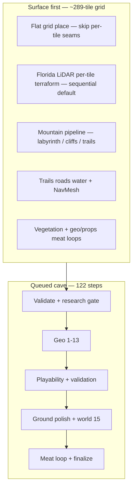

# Environment Authoring Kit

**`com.cursor.environment-authoring-kit`** — Unity Editor package for **procedural Florida karst surface + lava-tube cave worlds**, quality grading, and optional **Cursor SDK** automation.

Built for **Unity 6 (6000.x)** and **URP**. XR = **optimization profile + Unity XR packages** in the consumer project — **not** a bundled VITURE SDK or glasses-ready demo.

> **Public GitHub clone?** Read **[docs/PUBLIC_REPO_SCOPE.md](../../docs/PUBLIC_REPO_SCOPE.md)** first.

| | |
|--|--|
| **Unity** | 6000.0+ |
| **Rendering** | Universal Render Pipeline 17+ |
| **Surface terrain grid** | **~289 tiles (17×17, Chebyshev 8)** default — 81-tile core optional — [docs/SURFACE_TERRAIN_GRID_AND_OPEN_WORLD.md](docs/SURFACE_TERRAIN_GRID_AND_OPEN_WORLD.md) |
| **FullWorld concepts** | Hub layouts **0–9** + random on build — [docs/FULLWORLD_GENERATION_PRESETS.md](docs/FULLWORLD_GENERATION_PRESETS.md) |
| **Build progress** | Hub **Step** counter — every paced queue action (`CaveBuildStepCounter`; 122-index schedule is internal only) |
| **Node** | 18+ + `npm install` in `Tools/cave-grader` |
| **Version** | **0.3.3** — see `package.json` |
| **License** | [LICENSE.md](LICENSE.md) |

---

## Install

```json
{
  "dependencies": {
    "com.cursor.environment-authoring-kit": "file:Packages/com.cursor.environment-authoring-kit"
  }
}
```

Open the project in Unity and let scripts compile.

| Path | Role |
|------|------|
| `Assets/EnvironmentKit/Presets/` | Atmosphere/terrain ScriptableObjects — [README](../../Assets/EnvironmentKit/Presets/README.md) (not the Hub 1–20 list) |
| `Assets/EnvironmentKit/Recipes/` | JSON build recipes — committed |
| `Assets/EnvironmentKit/Generated/` | Per-build output — **gitignore** |
| `Assets/EnvironmentKit/ResearchCache/` | Local research — **gitignore** |
| Your `Assets/` art | Licensed prefabs (Hub → Settings → Prefab folders) |

---

## First build (public clone)

1. Unity **6** + URP.
2. **Node 18+**.
3. **Window → Environment Kit → Hub** → **Build Complete Cave**.

Procedural FullWorld with no API keys — watch **Step** climb in Hub. Enable a provider in Hub → Settings for AI grading when steps need it.

See [consumer README](../../README.md#first-build-after-clone).

---

## Quick start

1. **Hub → Build Complete Cave** — Hub opens automatically; **empty scene OK** (auto Ground + portal + grid).
2. Watch **Hub → Build** tab: **Step** + elapsed/ETC, main/sub-action, pipeline log.
3. Optional: **Cave Build Grader** — [CaveGradingAndCursor.md](docs/CaveGradingAndCursor.md).
4. Demo mode: use **Full AAA Rebuild + Recording** and follow [HELP_ME_RUN_ENVKIT.md](docs/HELP_ME_RUN_ENVKIT.md).

**Do not rely on Pipeline Console for normal builds** — it is an optional pop-out (**extra RAM**). Menu: **Diagnostics → Pipeline Console** redirects to Hub unless you force pop-out.

**Full AAA Rebuild** — Hub foldout **Stuck or half-built?** or Advanced menu — non-additive surface, per-phase prompts, maze annex carve ([FULL_AAA_REBUILD.md](docs/FULL_AAA_REBUILD.md)).

**Sequential terrain (default on):** Hub header → **Sequential FullWorld terrain** — each of the ~289 tiles finishes sculpt + seams before the next.

---

## Build menus

**Window → Environment Kit:**

| Menu | Scope | What it does |
|------|--------|----------------|
| **Hub** | — | Settings, **concept layouts 0–9**, live build monitor (**recommended**) |
| **Build Complete Cave Level (Active Scene)** | `FullWorld` | ~289-tile surface grid + vegetation + **122-step** cave queue |
| **Build Surface World Only (Active Scene)** | `SurfaceOnly` | Surface terrain grid / mountains only |
| **Snap Surface Terrain Grid (81 Tiles, Active Scene)** | — | Recovery — anchor snap + consolidate |
| **Expand Open World — Add Next Terrain Ring** | — | Incremental +1 Chebyshev ring (~289 target) |
| **Build Cave Only — Align to Surface (Active Scene)** | `CaveOnly` | Underground only |
| **Rebuild Complete Cave (MainScene)** | `FullWorld` | Opens `MainScene` if present locally, then full build |
| **Build Complete Cave — Full AAA Rebuild** | `FullWorld` | Clears incremental cache — recovery |
| **Terrain / Cave Build Grader** | — | Quality reports |

Diagnostics: preflight, invalidate ladder, unfreeze queue, etc.

### Layout checklist

[PROJECT_LAYOUT_PLAN_20_STEPS.md](docs/PROJECT_LAYOUT_PLAN_20_STEPS.md):

1. **Build Surface World Only**
2. **`WorldLayoutAudit.json`**
3. **Build Complete Cave** when audit allows

---

## FullWorld pipeline order


```mermaid
flowchart TB
  subgraph surface [Surface first — ~289-tile grid]
    S0[Flat grid place — skip per-tile seams]
    S1[Florida LiDAR per-tile terraform — sequential default]
    S2[Mountain pipeline — labyrinth / cliffs / trails]
    S3[Trails roads water + NavMesh]
    S4[Vegetation + geo/props meat loops]
  end
  subgraph cave [Queued cave — 122 steps]
    C0[Validate + research gate]
    C1[Geo 1-13]
    C2[Playability + validation]
    C3[Ground polish + world 15]
    C4[Meat loop + finalize]
  end
  surface --> C0 --> C1 --> C2 --> C3 --> C4
```

Details: [FULLWORLD_TERRAIN_AND_HUB.md](docs/FULLWORLD_TERRAIN_AND_HUB.md), [WORLD-GENERATION-PIPELINE-LADDER.md](docs/WORLD-GENERATION-PIPELINE-LADDER.md), [PHASE_CONTRACTS.md](docs/PHASE_CONTRACTS.md).

### Lean path (same build, less duplicate work)

You do **not** need every subsystem on every run. One FullWorld / Full AAA build already follows:

1. Surface grid + terraform → terrain AI phases → **geo meat → props meat** → terrain handoff  
2. Cave queue → **cave meat loop** → finalize  

**Ignore unless debugging:** Pipeline Console pop-out, Expand Open World ring menu (AAA uses full grid), duplicate terrain re-grade after meat (skipped automatically), second JSON writer (reports now use one exporter). **Cursor** is optional; C# pipeline runs without API keys.

---

## XR (honest)

| Kit provides | You provide |
|--------------|-------------|
| `VitureXRPro` optimization preset | XR Plug-in Management, OpenXR, device |
| Performance grading stage | Hardware playtest |

---

## Key code locations

| Area | Path |
|------|------|
| Hub | `Editor/Blockout/EnvironmentKitHubWindow.cs` |
| Build entry | `Editor/Blockout/LavaTubeCaveBuilder.cs` |
| 122-step schedule | `Editor/Blockout/CaveBuildQueuedPipelineSchedule.cs` |
| Extended open-world grid | `Editor/Blockout/SurfaceOpenWorldGridExpansion.cs` |
| 81-tile mountain core + grid placement | `Editor/Blockout/SurfaceTerrainTileExpansion.cs` |
| Startup | `Editor/Blockout/CaveBuildStartupCoordinator.cs` |
| Mountain phases | `Editor/Blockout/SurfaceMountainResearchPipeline.cs` |
| Node grader | `Tools/cave-grader/` |
| Demo recap + Personal Voice | `Tools/cave-grader/PERSONAL_VOICE_NARRATION.md`, `DEMO_RECAP_PIPELINE.md` |

---

## Cursor grader (Node)

```bash
cd Packages/com.cursor.environment-authoring-kit/Tools/cave-grader
cp .env.example .env
npm install
npm run doctor
./run-grade-and-fix.sh --auto --stream
```

[docs/CaveGradingAndCursor.md](docs/CaveGradingAndCursor.md).

---

## Generated artifacts (local)

Under `Assets/EnvironmentKit/Generated/`:

| File | Purpose |
|------|---------|
| `CaveBuildLiveRunStatus.md` | Live step / phase (Hub reads this) |
| `CaveBuildQualityReport.json` | Letter grade, ship blockers |
| `CaveBuildCompletionReadout.md` | Finish summary |
| `WorldLayoutAudit.json` | Layout acceptance between surface and cave |
| `OpenWorldGridManifest.json` | Built Chebyshev ring for incremental open world |

---

## Documentation

| Doc | Content |
|-----|---------|
| [docs/SURFACE_TERRAIN_GRID_AND_OPEN_WORLD.md](docs/SURFACE_TERRAIN_GRID_AND_OPEN_WORLD.md) | **Grid snap, fast seams, open world** |
| [docs/FULLWORLD_TERRAIN_AND_HUB.md](docs/FULLWORLD_TERRAIN_AND_HUB.md) | **Hub, sequential build, LiDAR** |
| [docs/README.md](docs/README.md) | Package doc index |
| [docs/REQUIREMENTS.md](docs/REQUIREMENTS.md) | Requirements |
| [CHANGELOG.md](CHANGELOG.md) | Version history |
| [docs/CaveGradingAndCursor.md](docs/CaveGradingAndCursor.md) | Grading + Cursor |
| [../../docs/PUBLIC_REPO_SCOPE.md](../../docs/PUBLIC_REPO_SCOPE.md) | GitHub scope |

---

## License

[LICENSE.md](LICENSE.md) — kit code. Geodata: [RESEARCH_DATA_ATTRIBUTION.md](docs/RESEARCH_DATA_ATTRIBUTION.md).
