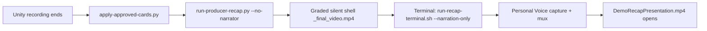

# Recap pipeline (restored flow)

End-to-end producer recap with **Personal Voice (Jacob Adkins)** — reliable path as of 2026-06-06.

## Flow



1. **Approved assets** — `apply-approved-cards.py` copies `ApprovedIntro.png`, `ApprovedOutro.png`, portrait, signature, and `ApprovedCards.json` from `DemoRecapApproved/` (never regenerates unless `--regen`).
2. **Unity headless video** — `CaveBuildDemoProducerCompose` runs `run-producer-recap.py` with `--no-narrator` on macOS when narrator is enabled. Builds intro → timelapse → holds → **outro at end**.
3. **Terminal narration** — Unity opens `run-recap-terminal.sh … --narration-only`. Personal Voice is captured in Terminal.app (not Unity’s headless python).
4. **Mux + open** — Narration muxes into `DemoRecapPresentation.mp4`. MP4 auto-opens when complete.

## Rules (do not break)

| Rule | Why |
|------|-----|
| `videoPlaybackFactor: 1.0` for full encode | Stretch to 8 min breaks voice/sync; use `--stretch-to-target` only if intentional |
| Never copy silent `_final_video.mp4` over narrated output | Compose refuses when audible `narration.wav` exists |
| `narratorRequirePersonal: true` | No system-voice fallback when Personal Voice required |
| `requireNarrationBeforeFinalize: true` | Exits instead of shipping silent “final” MP4 |

## Commands

```bash
cd ~/Hub/Packages/com.cursor.environment-authoring-kit/Tools/cave-grader

# Full run (Terminal — Personal Voice)
bash run-recap-terminal.sh /path/to/DemoCapture/<timestamp>

# Re-narrate existing graded shell only
bash run-recap-terminal.sh /path/to/DemoCapture/<timestamp> --narration-only

# Restore user's MP4 from last good backup
bash ~/restore-demo-recap.sh
```

## Crash recovery

If Unity reload interrupts compose, `CaveBuildDemoAutoRecorder` queues `PendingCompose` and resumes Terminal Personal Voice on next editor tick when the shell exists but MP4 has no audio.

See also: [DEMO_RECAP_PIPELINE.md](DEMO_RECAP_PIPELINE.md), [PERSONAL_VOICE_NARRATION.md](PERSONAL_VOICE_NARRATION.md).

## Video quality (producer v3 defaults)

| Setting | Default | Notes |
|---------|---------|-------|
| `outputWidth` / `outputHeight` | 1920 × 1080 | Was 1280×720; holds + timelapse letterbox to 1080p |
| `encodeCrf` | 18 | Segment + master grade (was 17 medium) |
| `encodePreset` | `slow` | Better compression efficiency at same CRF |
| `encodeTune` | `film` | Grain-friendly for terrain detail |
| `segmentXfadeSec` | 0.5 | Smoother segment transitions |
| `tlMaxFrames` | 72 | Key-moment pick (milestones + high-diff frames), not blind subsample |

Re-grade an existing run without re-capturing PNGs:

```bash
python3 regrade-demo-recap-video.py /path/to/DemoCapture/<timestamp>
# then remux narration if needed:
bash run-recap-terminal.sh /path/to/DemoCapture/<timestamp> --narration-only
```

## Annotation accuracy

- `DemoRecapOpenCV.json` is written by `run-producer-recap.py` from milestone `regions`.
- Region boxes: OpenCV vision (`demo-recap-opencv-annotate.py`) or Cursor director (`demo-recap-cursor-director.py`).
- Labels are synced to `phase` / `sub` / `teachingFocus` from `DemoRecapTimeline.json` (fixes generic labels like "Seam pass" on foothill beats).
- On-screen captions (`line1`–`line3`) use phase-aware `line3` hints from `demo-recap-captions.py`.

## Optional Stable Diffusion polish (standalone)

The default recap path is **unchanged**: Unity Scene timelapse PNGs → ffmpeg/producer compose → Personal Voice narration.

There is **no** built-in SD/ComfyUI/A1111 dependency in the main pipeline. Concept images and recap grading use Pillow/OpenCV/Cursor vision — not local diffusion.

### When SD helps (honest fit)

| Use case | Fit | Notes |
|----------|-----|-------|
| img2img polish on milestone frames | **Good** | Light denoise (0.2–0.35) sharpens stills without changing layout |
| Interpolate between timelapse frames | **Risky** | Hallucinates terrain; breaks educational accuracy |
| ComfyUI recap intro/outro cards | **Optional** | Better done in `DemoRecapApproved/` assets; SD is a stylistic override |
| Full timelapse SD pass | **Slow** | Hundreds of frames × GPU seconds; use `--milestone-only` first |

SD does **not** replace Personal Voice. Run SD **before** `run-recap-terminal.sh` if you want enhanced source frames; narration and mux stay the same.

### Standalone script

```bash
cd ~/Hub/Packages/com.cursor.environment-authoring-kit/Tools/cave-grader

# Automatic1111 / Forge on default port
export SD_API_URL=http://127.0.0.1:7860
export SD_API_PROVIDER=a1111
export SD_MODEL="your-checkpoint.safetensors"   # optional
python3 sd-enhance-recap.py /path/to/DemoCapture/<timestamp>

# Milestone frames only (faster)
python3 sd-enhance-recap.py /path/to/DemoCapture/<timestamp> --milestone-only

# ComfyUI — supply workflow JSON with {{IMAGE_B64}} placeholder
export SD_API_URL=http://127.0.0.1:8188
export SD_API_PROVIDER=comfy
export SD_COMFY_WORKFLOW=/path/to/recap-img2img-workflow.json
python3 sd-enhance-recap.py /path/to/DemoCapture/<timestamp>
```

Output: `<run>/timelapse_sd/tl_*.png` plus `timelapse_sd_manifest.json`. Original `timelapse/` is never overwritten.

Env tuning: `SD_DENOISE` (default `0.28`), `SD_STEPS`, `SD_PROMPT`, `SD_MAX_FRAMES`, `SD_SKIP_EXISTING=0` to re-render.

Future compose flag `--sd-enhance` can prefer `timelapse_sd/` when present; until wired, swap frames manually or symlink for experiments.

## Recap Dashboard (optional)

A **local-only** React + Python API for tuning recap settings between capture and compose. Unity can **auto-open** the dashboard when recording stops (Hub toggle **Open recap dashboard before compose**, default ON on macOS). Compose is **gated** until you click **Proceed to compose** in the UI or enable **Skip recap review** in Hub. Does **not** replace Terminal Personal Voice.

| Capability | Supported | Notes |
|------------|-----------|-------|
| Observe timelapse count, segments, silent shell, narration script | Yes | Polls capture folder + `DemoRecapTimeline.json` |
| Tune pacing in timeline JSON | Yes | Holds, intro/outro, timelapse gap — saved via API |
| Live preview during ffmpeg encode | Partial | Segment count grows in work dir; no frame-accurate progress bar yet |
| Edit milestones / OpenCV regions in UI | No | Still file-based or re-run director |
| Personal Voice capture in browser | No | Must stay in Terminal.app (`run-recap-terminal.sh`) |
| SD enhance toggle | No | Run `sd-enhance-recap.py` separately (env vars) |

### When to open

Best intervention window: **after recording stops** (`DemoRecapTimeline.json` written) and **before** you approve silent preview → narration-only. Also useful while a long Personal Voice pass runs (read-only status).

### Run

```bash
cd ~/Hub/Packages/com.cursor.environment-authoring-kit/Tools/cave-grader

# One command (API + Vite dev UI + browser)
bash start-recap-dashboard.sh /path/to/DemoCapture/<timestamp>

# Or API only
python3 recap-dashboard-server.py --capture /path/to/DemoCapture/<timestamp>
```

When Unity stops recording with the gate enabled: server starts via `start-recap-dashboard.sh --no-open`, browser opens with `?capture=` encoded path, compose waits until **Proceed** (or Hub skip / auto-proceed timeout).

Cursor agents: see **`RECAP_AGENT_API.md`** (`PATCH /api/capture/timeline`, compose triggers, gate proceed).

Recommended workflow from the dashboard:

1. **Save timeline** — adjust `milestoneHoldSec`, `subbeatHoldSec`, `introSec`, `outroSec`, etc. (`videoPlaybackFactor` stays locked at `1.0`).
2. **Silent preview** — POST triggers `run-recap-terminal.sh … --preview --no-narrator`.
3. **Narration-only** — POST triggers Terminal Personal Voice when silent shell exists.

The recap dashboard shows a **video editor live feed** (`/api/capture/compose/live`) — compose job, segment progress, and `RecapComposeLive.log`. It does not show Unity world-build status.

See `recap-dashboard/README.md` for details.
