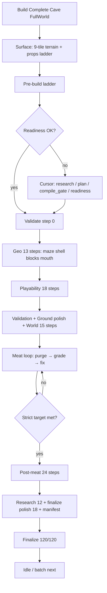

# AAA procedural cave generation: autonomous Unity + Cursor pipeline

Design, implementation, and research guideline for the Environment Authoring Kit cave pipeline.  
Use with [CaveGradingAndCursor.md](./CaveGradingAndCursor.md) and [CAVE-BUILD-WORKFLOW-HARMONY.md](./CAVE-BUILD-WORKFLOW-HARMONY.md).

**Scope:** “AAA” here means **production grading tiers** (Ship / Beta) and internal feature manifests — not a claim that GitHub ships a finished commercial game or XR device certification. See [PUBLIC_REPO_SCOPE.md](../../../../docs/PUBLIC_REPO_SCOPE.md).

---

## Table of contents

1. [Overview](#1-overview)
2. [System architecture](#2-system-architecture)
3. [Scheduling: sleep and rate limits](#3-scheduling-sleep-and-rate-limits)
4. [Strategic flow (pseudocode)](#4-strategic-flow-pseudocode)
5. [Unity / kit entry points (not MonoBehaviour)](#5-unity--kit-entry-points-not-monobehaviour)
6. [Example Cursor research prompt](#6-example-cursor-research-prompt)
7. [Grading targets](#7-grading-targets)
8. [Batch and error handling](#8-batch-and-error-handling)
9. [Research URLs (2025–2026)](#9-research-urls-20252026)
10. [Agent memory](#10-agent-memory)
11. [Implementation map (this repo)](#11-implementation-map-this-repo)

---

## 1. Overview

**Goal:** Automate AAA-quality cave generation, grading, QA, and research enrichment with:

- End-to-end phases: **pre-build → geometry → playability → world → meat loop → post-meat → export**
- Research from `CaveBuildResearch.json` plus agent web policy in prompts
- Rate limiting via **editor queue + load-scaled sleep**, not blocking `Thread.Sleep` on the main thread
- Workflow coordinator so phases do not undo each other’s work

---

## 2. System architecture



---

## 3. Scheduling: sleep and rate limits

| When | Kit mechanism | Avoid |
|------|----------------|-------|
| Between heavy editor steps | `CaveBuildActionPacing.ScheduleBuildStep` + load-scaled cooldown | `Thread.Sleep` on Unity main thread |
| After Cursor agent invoke | Stream phase-complete + single workflow advance | Double `AdvancePreBuildWorkflow` from poll + stream |
| Between meat grade batches | Separate queue steps (4 batches + finalize) | Monolithic `Grade()` + purge in one tick |
| Between API / research fetches | 0.2–1s pacing labels; pre-build `compile_gate` skip when already passing | Tight loop re-invoking same rung |
| After asset JSON export | `CaveBuildDeferredAssetRefresh` (one refresh per queue batch) | `AssetDatabase.Refresh` inside every writer |

Configurable delays: `CaveBuildCursorSettings`, `CaveBuildActionPacing` (Light / Normal / Heavy).

---

## 4. Strategic flow (pseudocode)

```text
start_pipeline():
  CaveBuildWorkflowCoordinator.BeginSession()
  log("Pipeline started")

  # Pre-build (may defer geometry until Cursor pre-build completes)
  pace_sleep(light)
  if not pre_build_phase():
    auto_fix_prebuild_via_cursor()
    pace_sleep(normal)
    recheck_pre_build()

  # Build (queued or sync)
  pace_sleep(normal)
  geometry_and_playability_and_world()

  # Meat loop (editor queue; not a tight while-loop on main thread)
  meat_pass = 0
  while not meets_strict_target() and meat_pass < 16:
    purge_shell_only()          # do not delete committed walkways
    grade_in_batches(4)
    enrichment_pass()           # props / materials / atmosphere / visual
    fix_one_rung_depth_only()   # ground: mouth Y only, lock XZ
    meat_pass++

  pace_sleep(normal)
  post_build_qa()
  if not meets_strict_target():
    optional_cursor_post_build()

  pace_sleep(heavy)  # after research fetch if agent runs
  export_outputs()
  CaveBuildWorkflowCoordinator.EndSession()
```

---

## 5. Unity / kit entry points (not MonoBehaviour)

The kit runs in the **Editor**, not as a runtime `MonoBehaviour` pipeline.

| Your sketch | Actual type |
|-------------|-------------|
| `CaveGenAutomation.StartPipeline()` | `LavaTubeCaveBuilder.BuildInActiveScene` |
| `PreBuild()` | `CaveBuildUnifiedFlow.TryRunPreBuildPhase` + `CaveBuildPreBuildLadder.Run` |
| `BuildPhase()` | `LavaTubeCaveBuildPipeline.QueueRun` or `.Run` |
| `PostBuildPhase()` | Queued post-meat steps + `CaveBuildPostBuildWorkflow` |
| `AutoFixProblems()` | `CaveBuildQualityStageFixer` + `CaveBuildMeatLoopEnrichment` |
| `ResearchEnrichIfNeeded()` | `CaveBuildResearchExporter` + agent prompt policy |
| `ExportSceneAndReport()` | `CaveBuildQualityReportWriter` + `FinishQueued` |

Phased builds: enable **Use Phased Cave Build** on `CaveBuildCursorSettings`.

---

## 6. Example Cursor research prompt

```text
Task:
If any phase or scoring rung is below pass threshold, summarize improvements from
CaveBuildResearch.json and 2025–2026 sources (arXiv, ACM, IEEE CoG, GDC, Unity 6 docs).

Instructions:
1. Read Assets/EnvironmentKit/Generated/CaveBuildLadderContext.json (activeRung, failingRungs).
2. Read CaveBuildResearch.json and CaveBuildAgentMemory.json (do not repeat resolved failures).
3. If techniques are outdated, cite new papers/tools with URL and year (≥2025).
4. Apply fixes in-package only; re-run compile_gate before scene rebuild.
5. Report: citations, fixes applied, updated scores.
```

Shipped prompts: `Tools/cave-grader/prompt-ladder/`, `CaveBuildActiveRungPrompt.md`.

---

## 7. Grading targets

| Layer | Threshold | Where |
|-------|-----------|--------|
| Pre-build readiness rung | ≥ 92 per rung | `CaveBuildPreBuildLadder.StagePassScore` |
| Full build acceptable | ≥ 88 overall | `CaveBuildQualityRubric.TargetOverallScore` |
| **Strict / stop Cursor loop** | **≥ 99 overall + stage floors + not dud** | `CaveBuildQualityRubric.MeetsStrictTarget` |
| Letter AAA+ | Rubric letter + visual_shell floors | Meat loop exit + post-build skip invoke |

Your table (asset validation, navmesh, connectivity, etc.) maps to **stage rubric** in `CaveBuildQualityGrader` (`visual_shell`, `navmesh`, `spawn_reachability`, `terrain_integration`, …), not a separate 100-point checklist file.

---

## 8. Batch and error handling

| Policy | Implementation |
|--------|----------------|
| Retry with sleep | `CaveBuildActionPacing` + meat loop max 16 passes |
| Below target → fix → re-grade | `CaveBuildQualityLadder.PickNextRung` + `TryFix` |
| compile_gate retries | Max 3 in `CaveBuildCursorAgentBridge` |
| Skip invoke at strict target | `ShouldInvokeForReport` |
| Batch next job | `CaveBuildBatchRunner.cs` — N seeds, paced delay, `CaveBuildBatchLog.json` |
| Research phase | `CaveBuildResearchPhase.cs` — queued steps 49–51 |
| AAA 100pt checklist | `CaveBuildAaaFeatureGrader.cs` — `CaveBuildAaaFeatureManifest.json` |
| Failure log | `CaveBuildAgentMemoryExporter.RecordFailure` |

---

## 9. Research URLs (2025–2026)

Seed list in `CaveBuildResearch.json` / `CaveBuildResearchSources` — MIT Game Lab, CMU ETC, Georgia Tech, UCSC, SIGGRAPH, GDC Vault, arXiv, Game Developer, Unity Asset Store, GitHub, itch.io.

Agent must not store API keys in repo; use `Tools/cave-grader/.env`.

---

## 10. Agent memory

On each pass:

- Write scores and failures to `CaveBuildAgentMemory.json`
- Append research summaries to workflow context exporters
- Fingerprint failures so the next run skips resolved issues (`memory_no_repeat` in pre-build workflow)

---

## 11. Implementation map (this repo)

| Design phase | Primary scripts |
|--------------|-----------------|
| Coordinator | `CaveBuildWorkflowCoordinator.cs` |
| Queue / sleep | `CaveBuildActionPacing.cs`, `LavaTubeCaveBuildPipeline.Queued.cs` |
| Pre-build | `CaveBuildPreBuildLadder.cs`, `CaveBuildCursorAgentBridge.cs` (pre-build workflow) |
| Geometry | `CaveAdventureCaveGenerator.QueuedSteps.cs`, `SplineLavaTubeCaveGenerator.cs` |
| Playability | `CaveAdventurePlayabilityPipeline.cs` |
| World | `LavaTubeCaveBuildPipeline` world stages, `ScatterExtraProps` |
| Meat loop | `CaveBuildQualityMeatLoop.Queued.cs`, `CaveBuildMeatLoopEnrichment.cs` |
| Research (queued) | `CaveBuildResearchPhase.cs` |
| AAA manifest | `CaveBuildAaaFeatureGrader.cs` |
| Batch | `CaveBuildBatchRunner.cs` |
| Ground / mouth | `CaveGroundPlacementUtility.TrySnapMouthToSurfaceDepthOnly` |
| Purge (no walkway fight) | `CaveCompactLayerPurge.PurgeShellLayersOnly` |
| Cursor SDK | `Tools/cave-grader/grade-and-fix.ts`, `CaveBuildCursorAgentBridge.cs` |
| Harmony rules | [CAVE-BUILD-WORKFLOW-HARMONY.md](./CAVE-BUILD-WORKFLOW-HARMONY.md) |

**Implemented (design gaps closed):**

- **Research phase** — queued steps after post-meat: catalog refresh → enrichment JSON → optional Cursor `research` rung (`CaveBuildResearchPhase.cs`)
- **Batch mode** — `Window → Environment Kit → Run Batch Cave Builds` or `enableBatchMode` on settings (`CaveBuildBatchRunner.cs`)
- **AAA 100-point manifest** — `CaveBuildAaaFeatureManifest.json` from `CaveBuildAaaFeatureGrader.cs` (step 52 in queued pipeline)

---

## Final notes

- Autonomous mode = flags on `CaveBuildCursorSettings` (pre-build workflow, phased build, auto-invoke, auto-rebuild).
- Prefer **one-button** `Build Complete Cave Level` over custom `MonoBehaviour` drivers.
- Visualize progress in Console `[CaveBuild]` / `[CaveCursor]` and progress bar during meat loop.
