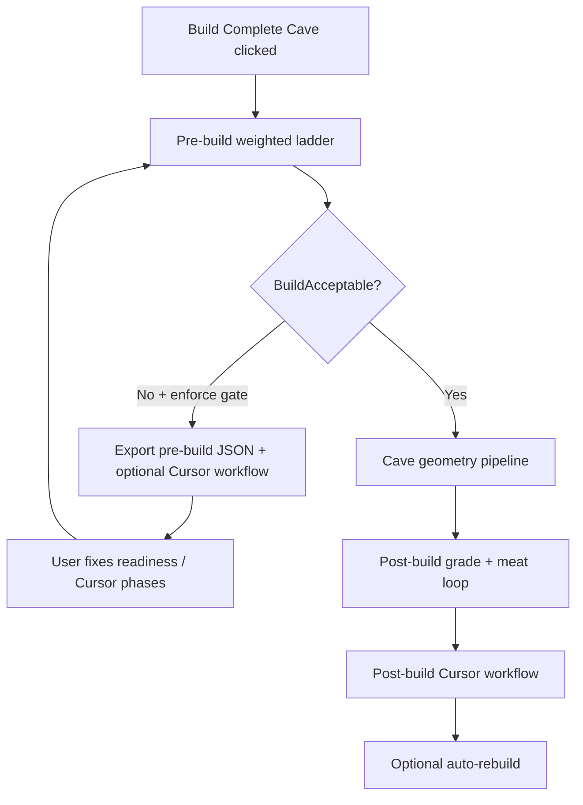
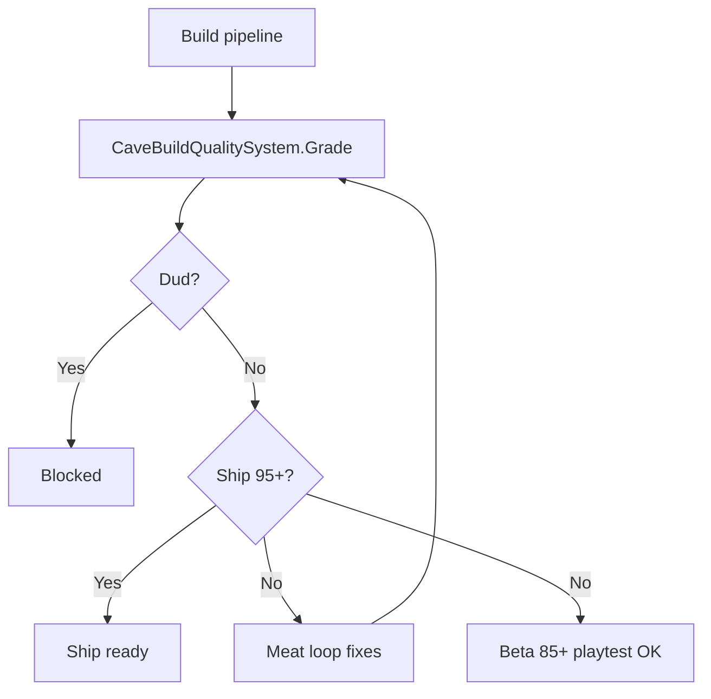

# Cave grading and Cursor API

The Environment Authoring Kit grades every cave build with **commercial production tiers** (Ship / Beta / Alpha / Prototype / Blocked) so **dud generations** (onion layers, prototype/full mismatch) are caught before you play. See [COMMERCIAL-PRODUCTION-GRADING.md](./COMMERCIAL-PRODUCTION-GRADING.md).

## Unity menus

| Menu | Purpose |
|------|---------|
| **Window → Environment Kit → Cave Build Grader** | Letter grade, failing stages, Re-grade, Export Agent Prompt, Invoke Cursor Agent |
| **Window → Environment Kit → Grade Cave Build (Active Scene)** | Quick re-grade |
| **Window → Environment Kit → Cave Build → Invoke Cursor Agent (Grade & Fix)** | Runs TypeScript SDK script |
| **Window → Environment Kit → Cave Build → Request Live Fix (Cursor)** | Play-mode issues → agent (includes `Assets/Scripts/`) |
| **Window → Environment Kit → Cave Build → Run Pre-Build Gate Only** | Weighted readiness ladder without generating cave geometry |

## Outputs

- `Assets/EnvironmentKit/Generated/CaveBuildQualityReport.json` — scores, `dudReasons[]`, `recommendedAction`
- `Assets/EnvironmentKit/Generated/CaveBuildGradingManifest.json` — stage weights for SDK
- `Assets/EnvironmentKit/Generated/CaveBuildAgentPrompt.md` — human/agent summary (active ladder rung only)
- `Assets/EnvironmentKit/Generated/CaveBuildResearch.json` — **prestige R&D lab papers** + `floridaTerrain` paths (when cache synced)
- `Assets/EnvironmentKit/Generated/CaveBuildResearchCache.json` — pointer to `ResearchCache/index.json` + county hillshade paths
- `Assets/EnvironmentKit/ResearchCache/` — categorized entries, images, Florida aquifer/karst refs (**local**; gitignored on public Hub — run `npm run sync-research-pull` after clone)
- `Assets/EnvironmentKit/Generated/CaveBuildLadderContext.json` — `activeRung`, `failingRungs`, `minResearchYear`, ground placement
- `Assets/EnvironmentKit/Generated/CaveBuildVisualShellAudit.json` — onion metrics for `visual_shell` rung
- `Assets/EnvironmentKit/Generated/CaveLiveFixRequest.json` — play-mode issues
- `Assets/EnvironmentKit/Generated/CaveBuildPreBuildLadderReport.json` — readiness scores **before** cave generation
- `Assets/EnvironmentKit/Generated/CaveBuildPreBuildLadderContext.json` — pre-build `activeRung`, `failingRungs`
- `Assets/EnvironmentKit/Generated/CaveBuildPreBuildWorkflowContext.json` — pre-build Cursor phase checklist

## What to install (there is no separate “local SDK” download)

| Piece | Where | Purpose |
|-------|--------|---------|
| **Cursor desktop app** | [cursor.com](https://cursor.com) | Required for **local** headless agents (`local: { cwd }` in SDK) |
| **`@cursor/sdk` npm package** | `Tools/cave-grader` after `npm install` | TypeScript API used by `grade-and-fix.ts` — not a separate installer |
| **Node.js 18+** | [nodejs.org](https://nodejs.org) or Homebrew | Runs `tsx` scripts |
| **API key** | [Cloud Agents dashboard](https://cursor.com/dashboard/cloud-agents) | Same account as the app; `CURSOR_API_KEY` in `.env` |
| **Cursor CLI** (optional) | In Cursor: Command Palette → **Shell Command: Install 'cursor' command in PATH** | Terminal `cursor` command; cave grader uses Node SDK instead |

**IDE chat (Composer)** and **`grade-and-fix.ts`** are different: the script starts a headless agent via the API. Local runs need the app open and signed in.

## Cursor API setup (one-time)

1. Create a key at [Cursor Cloud Agents dashboard](https://cursor.com/dashboard/cloud-agents).
2. Install grader tools:

   ```bash
   cd Packages/com.cursor.environment-authoring-kit/Tools/cave-grader
   # HUB_ROOT in .env = absolute path to your Unity project
   npm install
   npm run doctor
   ```

   `npm run doctor` checks the API key, lists models, and runs a one-line local smoke test.

3. **Single source of truth — `.env` file** (gitignored):

   ```bash
   cp .env.example .env
   # Edit .env — set CURSOR_API_KEY for Cursor workflow; optional GOOGLE/ANTHROPIC/OPENAI/OPENROUTER/CUSTOM keys for Hub provider routing
   ```

   Unity: **Window → Environment Kit → Cave Build → Sync API Key from .env** (copies into EditorPrefs for builds).
   
   > Provider note: Hub stores multiple provider keys and model ids, but the built-in `grade-and-fix.ts` runtime currently executes via Cursor SDK (`CURSOR_API_KEY`).

4. Optional: open `CaveBuildCursorSettings` for Hub root, model id. If Unity cannot find Node, set **Node Executable** to `/usr/local/bin/node`.

5. **Terminal commands** (no manual `export` needed if `.env` exists):

   ```bash
   cd Packages/com.cursor.environment-authoring-kit/Tools/cave-grader
   # HUB_ROOT in .env = absolute path to your Unity project
   ./run-grade-and-fix.sh --auto --stream
   npm run run
   npm run watch-grade
   ```

   Default behavior (`--auto`): try **local** first; if the run errors and `CAVE_CURSOR_REPO_URL` is set, retry on **cloud**. Force cloud: `./run-grade-and-fix.sh --cloud --stream`. Local only: `--local-only`.

### Pre-build gate → build → post-build workflow



**Pre-build** (before geometry): weighted rungs `compile_gate`, `package_tooling`, `scene_ground`, `prefab_catalog`, `cursor_api`, `research_manifest`, `scene_portal`, `prior_cave_state`. Target **B+** (88+). Layout prototype skips the gate.

When the gate fails and **Enforce Pre-Build Gate** is on, Unity **does not** run the cave pipeline. With **Auto Invoke Pre-Build Workflow**, Cursor runs: `research` → `plan` → `compile_gate` → up to **3** readiness ladder rungs → then **geometry continues automatically** (queued pending build via `CaveBuildPendingGeometryBuild`). Unity does **not** also schedule post-agent **auto-rebuild** for that same completion (avoids duplicate full builds).

Chained steps use **`CaveBuildActionPacing`** (~0.3s between actions, one deferred action per editor tick) so heavy builds do not run inside a nested `EditorApplication.update` drain.

Env: `CAVE_WORKFLOW=pre_build` or `--workflow=pre-build` on `grade-and-fix.ts`.

### Prompt ladder (focused agent passes)

`grade-and-fix.ts` picks **one rung** per invoke (not a giant blob):

1. `visual_shell` — onion layers, AdventureShell, PathPlatforms, block rings  
2. `ground_placement` — cave root below `SceneGroundInfo` surface  
3. `navmesh` — floor bake / `BakeNavMeshOnly`  
4. `materials` — materials + lighting  
5. `performance` — XR / collider budget  
6. `other` — remaining critical failures  

Templates: `Tools/cave-grader/prompt-ladder/rung-*.md`. Override: `--rung=ground_placement` or env `CAVE_CURSOR_RUNG`.

After **Build Complete Cave**, Unity runs a **post-build workflow** (when auto-invoke is on):

1. **research** — prestige-lab papers + plan table (no C# edits)  
2. **compile_gate** — fix all C# errors using plan + `CaveBuildCompileDiagnostics.json` (retries up to 3× if compile still fails)  
3. **ladder** — up to **3** scene rungs (`visual_shell`, …) with failure memory  

Then optional auto-rebuild. Meat-loop passes do **not** repeat the full workflow; only the final build completion does.

**Cave Build Cursor Settings:** `autoInvokePreBuildWorkflow` (default on), `enforcePreBuildGate` (default on, blocks build when readiness fails), `autoContinueAfterPreBuildCursor` (default on — run queued geometry after pre-build), `autoRebuildAfterAgentSuccess` (post-build / generic agent success only; skipped when pre-build geometry continuation is queued).

**Project docs (Hub repo):** `README.md`, `REQUIREMENTS.md`, `docs/CHANGELOG.md` at repository root — update when changing workflows or acceptance criteria.

### Research cache (local first — Florida panhandle + aquifer)

Sync categorized research under `Assets/EnvironmentKit/ResearchCache/`:

```bash
cd Packages/com.cursor.environment-authoring-kit/Tools/cave-grader
HUB_ROOT=/path/to/Hub npm run sync-research-cache
HUB_ROOT=/path/to/Hub npm run sync-florida-hillshades   # Bay, Washington, Jackson, Calhoun PNGs
# or: npm run sync-florida-terrain
```

**Policy:** Florida LiDAR + Floridan aquifer data are **cave-structure only** (bare-earth DEM, DS 926 thickness, karst/subsidence). Do **not** use water table, TDS, bathymetry, or inundation products for underground void layout.

**Attribution:** [RESEARCH_DATA_ATTRIBUTION.md](./RESEARCH_DATA_ATTRIBUTION.md) (USGS, NOAA, FGS/FDEP, NWFWMD).

Unity build runs `sync-research-cache` in the research phase. Optional hillshades: `CAVE_SYNC_FL_HILLSHADES=1`.

### Web research (cache miss only)

Every `grade-and-fix.ts` prompt forces the agent to:

1. Read local grade JSON (situation)  
2. **Read `ResearchCache/`** + `CaveBuildResearchCache.json` + `CaveBuildResearch.json` (do **not** re-fetch cached URLs)  
3. For `ground_placement`: open county hillshades + aquifer entries listed under `floridaTerrain`  
4. Fetch **lab papers** subset only if cache does not answer (EA SEED, Microsoft, NVIDIA, Ubisoft, Sony, …)  
5. **Write a plan** (cite URL + JSON metric per step)  
6. **Execute** kit C# changes for the active rung  
7. Tell you to rebuild the cave in Unity  

Catalog: `Tools/cave-grader/research-catalog.ts` → `CaveBuildResearch.json` on every grade (full list). **Agent prompt** only injects ~5 papers + 3 lab indices per rung (see `promptBudget` in JSON). Regenerate seed: `npm run sync-research-catalog` in `Tools/cave-grader`. Env `CAVE_CURSOR_WEB_RESEARCH=1` is set on the process.

The agent needs **web search / fetch tools** enabled in Cursor (local or cloud) for cache misses only.

### Meat loop vs Cursor API

| Each meat-loop pass (0–16) | Cursor API |
|----------------------------|------------|
| Re-grades scene, writes `CaveBuildQualityReport.json` + `CaveBuildMeatLoopAgentPrompt.md` | Off by default (`invokeCursorAgent: false` so Unity is not blocked 16 times) |
| Applies in-editor fixes (`CaveBuildQualityStageFixer`) | — |
| End of meat loop | One background `grade-and-fix.ts` if build still not **Ship** (95+) |

Enable **Invoke each meat-loop pass** on `Cave Build Cursor Settings` to start the API after every pass (skips if an agent is already running). Each run reads the latest JSON from disk.

   If you see `Agent run failed: run-…` (exit 2), the SDK **started** the agent but the run errored. Use `--stream` to see `[status]` / `[tool error]` lines. `Agent.getRun` often fails for local runs after dispose — that is normal.

   **Manual fallback (always works):** open the Hub project in Cursor IDE and paste `Assets/EnvironmentKit/Generated/CaveBuildAgentPrompt.md` into a new Agent chat.

   **Onion layers in the scene are fixed in Unity, not by this script:**
   `Window → Environment Kit → Remove Cave Layered Shells` → delete old cave → `Build Complete Cave Level` or `Build Cave Layout Prototype`.

## Dud detection

A build is a **dud** when any of:

- Horizontal onion (AdventureShell, stacked ceilings, Y-band renderer clustering)
- `visual_shell` &lt; 80 (hard) or &lt; 95 on full build (strict)
- Path shorter than mode minimum
- NavMesh failed on full build
- Any critical stage &lt; 70
- `mode_consistency` failure (prototype has ceiling/blocks, or full build is layout-only)

Duds set `buildAcceptable: false` and force **Blocked** tier.

## Play mode loop

1. Enter Play Mode with a generated cave.
2. `CaveLiveBuildMonitor` fires `OnCaveReady` / periodic checks.
3. `CavePlayModeGrader` writes `CaveLiveFixRequest.json` on walkability/shell issues.
4. Use **Request Live Fix (Cursor)** or enable auto-invoke to run `grade-and-fix.ts --live`.

## Build pipeline

- **Layout prototype** — grade only; no meat loop.
- **Full build** — meat loop until **Ship** (95+) or passes exhausted; **Beta** (85+) = `buildAcceptable`.


