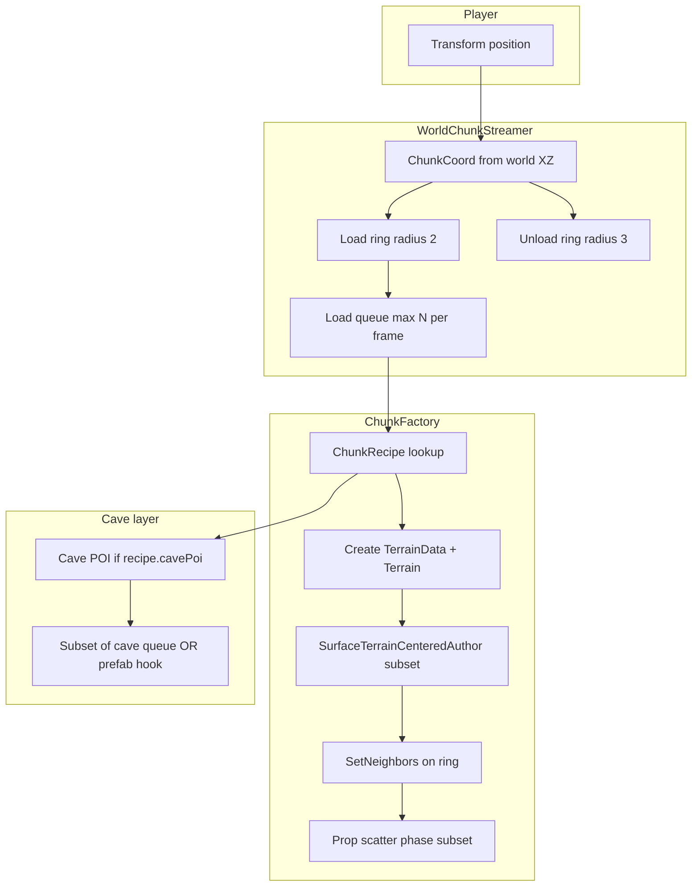

# Option A — Horizon-style open zone (implementation plan)

**Status:** Draft for review — **no code until approved**  
**Decision:** Option A (not infinite NMS / MMO on day one)  
**Research basis:** [`RESEARCH_OPEN_WORLD_STREAMING.md`](RESEARCH_OPEN_WORLD_STREAMING.md) — 60 catalogued sources, synced to `Assets/EnvironmentKit/ResearchCache/`  
**Last updated:** 2026-05-29

---

## 1. Executive summary

Option A turns the Environment Kit from a **“large play pad”** (1 main terrain + up to 8 neighbors, single-session bake) into a **bounded open zone**: approximately **4 km × 4 km** walkable Florida karst surface, divided into **128 m × 128 m chunks** on a **32 × 32 grid** (1024 chunks on disk, **~25 loaded** at runtime in a 5×5 ring).

The **cave pipeline** (122 queued steps, labyrinth annex, grand cavern, etc.) remains the quality core but runs **per region or per POI**, not as one editor click over the entire zone.

**Definition of done (player-facing):** Walk 15–30 minutes in one direction without a loading screen, without obvious tile repetition, with landmarks (peaks, sinkholes, trail forks) visible on the horizon; memory stable after 10+ minutes of chunk churn.

**Definition of done (engineering):** Chunk load hitch p95 &lt; 50 ms on target desktop; no floating-point shimmer within the zone after origin rebasing; cave entrance at spawn + optional POI caves discoverable along trails.

---

## 2. Scope boundaries

### In scope (Option A v1)

| Item | Target |
|------|--------|
| World extent | **4096 m × 4096 m** (4 km²), fixed bounds |
| Chunk size | **128 m** edge (32×32 grid) |
| Runtime load | **Load radius 2**, **unload radius 3** (ESEngine / Godot indie defaults) |
| Terrain tech | Unity **Terrain** per chunk, `SetNeighbors` for seams |
| Surface content | Reuse **Florida DEM stamp**, trails, props, twin peaks — **per chunk recipe** |
| Cave | **One primary** cave under spawn chunk + **sparse POI caves** (seed graph) |
| Editor | Bake **chunk recipes** offline; **Play Mode** streaming required for v1 wow |
| Floating origin | Rebasing when player &gt; **2000 m** from session origin |

### Explicitly out of scope (defer)

- Infinite procedural extension (NMS / Infinigen / WorldGrow) — Phase 4+
- MMO server interest management, replication — future
- Full 122-step cave bake under every chunk
- Addressables asset pipeline **required** for v1 (optional enhancement)
- Quest/NPC systems — only POI hooks and entrance markers

---

## 3. Current kit vs target (gap analysis)

### What exists today

```text
SurfaceTerrainTileExpansion
  └─ 1× SurfaceTerrainMain + up to 8 neighbors (cardinal/diagonal)
  └─ QueueAttachGameplayTiles (one neighbor per editor frame)
  └─ SetNeighbors + Florida LiDAR per tile
  └─ Gated by SurfaceExtentMeters (~80–512 m) and gameplay score

CaveBuildQueuedPipelineSchedule
  └─ 122 steps / 15 geo steps — single-scene FullWorld or CaveOnly

CaveLayoutRoll
  └─ SurfaceTileLayoutVariant, maze flavor, random seed

ResearchCache + cave-grader
  └─ 60 open_world_streaming papers, Florida hillshades, grading ladder
```

### What Option A adds

```text
WorldZoneSpec (new)
  └─ worldSeed, originChunk, gridSize 32×32, chunkMeters 128

WorldChunkStreamer (new, runtime + optional editor preview)
  └─ Player chunk (cx, cz) → load/unload Terrain + props + connectivity

ChunkRecipe (new, ScriptableObject or JSON)
  └─ hash(worldSeed, cx, cz) → DEM county subset, biome ring, POI ids, cave POI flag

WorldFloatingOrigin (new)
  └─ Rebases loaded chunk roots + UndergroundCaveSystem anchor

SurfaceTerrainTileExpansion (evolve)
  └─ From “attach 8 neighbors once at build” → “factory for any (cx,cz) in grid”
```

**Key insight:** `SurfaceTerrainTileExpansion` already solves **seam alignment** and **per-tile Florida sculpt**; Option A generalizes coordinates from `{0,0} main + 8 offsets` to **`(cx, cz)` on a global grid**.

---

## 4. Architecture

### 4.1 Coordinate systems

| Space | Definition |
|-------|------------|
| **Chunk index** | `(cx, cz)` integers, `0 … 31` for 4 km / 128 m |
| **Chunk origin (world)** | `(cx * 128, 0, cz * 128)` meters |
| **World seed mix** | `chunkSeed = Hash(worldSeed, cx, cz)` — stable across sessions |
| **Session origin** | Floating rebasing reference; player kept near Unity origin |

### 4.2 Runtime data flow



### 4.3 Memory budget (desktop target)

| Asset | Loaded (5×5 ring) | Notes |
|-------|-------------------|--------|
| Terrain tiles | 25 × ~4–8 MB heightmap | 513² or 257² per tile — tune in Phase 0 spike |
| Props | Budget per `EnvironmentKitHardwareBudget` | Chunk-scoped scatter flush |
| Cave meshes | 1 full cave + 0–2 partial POI | Do not load 25 full caves |
| Addressables | Optional | Scene-per-chunk if not procedural |

**Research anchors:** Slashskill console ~2–3 GB streaming budget; load **≤2 ms/frame** amortized on console — desktop can be looser but keep hitch cap.

### 4.4 Chunk recipe schema (draft)

```json
{
  "cx": 12,
  "cz": 7,
  "chunkSeed": 3847291045,
  "biome": "karst_plain",
  "demCounty": "Washington",
  "demUvRect": [0.2, 0.5, 0.35, 0.65],
  "surfacePasses": 3,
  "includeTrails": true,
  "includeMountains": false,
  "poiIds": ["vista_sinkhole_03"],
  "cavePoi": "minor_catacomb",
  "layoutVariant": 2
}
```

Recipes are **deterministic** from `(worldSeed, cx, cz)` so agents can regenerate without hand authoring 1024 files (start with **procedural recipes**, optional hand overrides for spawn chunk).

### 4.5 Cave strategy (Option A)

| Type | Count | Pipeline |
|------|-------|----------|
| **Spawn mega-cave** | 1 | Full 122-step queue once; anchor at world `(16,16)` chunk or Ground anchor |
| **POI caves** | ~8–16 across zone | Reduced queue (~40 steps) or prefab + entrance carve only |
| **Non-POI chunks** | ~1000 | Surface only; optional shallow sinkhole mesh, no full labyrinth |

**Rationale (Elden Ring / FromSoftware research):** Overworld density + **instanced dungeons** beats one empty map with a cave under every cell.

---

## 5. Phased delivery plan

### Phase 0 — Design spike (3–5 days, no player-facing ship)

**Goals:** Validate numbers before rewriting the pipeline.

| Task | Output |
|------|--------|
| Terrain resolution spike | 128 m tile @ 513 vs 257 heightmap — measure MB + stitch quality |
| Load hitch probe | Instantiate 25 terrains in Play Mode, measure frame spikes |
| Floating origin prototype | Rebasing script on dummy cubes at 3000 m offset |
| Recipe hash proof | Same `(seed,cx,cz)` → identical `ChunkRecipe` JSON |

**Exit criteria:** Written go/no-go on Unity Terrain vs clipmap fallback (research #51).

---

### Phase 1 — Streaming core (MVP “wow”, 2–3 weeks)

**Goals:** Walk across multiple chunks in Play Mode without editor freeze.

| # | Work item | Touches |
|---|-----------|---------|
| 1.1 | `WorldZoneSpec` asset + menu item | New `Editor/Blockout/World/` |
| 1.2 | `WorldChunkCoord` + `WorldChunkStreamer` (Play Mode) | Runtime assembly or editor play driver |
| 1.3 | `ChunkRecipeGenerator` from `worldSeed,cx,cz` | Extends `CaveLayoutRoll` hashing patterns |
| 1.4 | Refactor `SurfaceTerrainTileExpansion` → `SurfaceChunkTerrainFactory.Create(cx,cz)` | Existing expansion file |
| 1.5 | Load/unload ring; max **1 terrain create per frame** | Match existing `QueueAttachGameplayTiles` pacing |
| 1.6 | `SetNeighbors` for all loaded chunks on each change | Existing `RefreshTerrainConnectivity` |
| 1.7 | `WorldFloatingOrigin` when ‖player‖ &gt; 2000 | New component |
| 1.8 | Debug overlay: chunk grid, loaded ring, hitch ms | Editor gizmo |

**Not in Phase 1:** Full prop scatter, cave POIs, Addressables.

**Test plan:**

1. Enter Play Mode in 4 km zone; walk 500 m north — ≥3 chunks load, no seams &gt; 0.5 m.
2. Walk back — unload does not leak Terrains (memory profiler flat).
3. Teleport to `(3500, 0, 3500)` — origin rebase, no mesh jitter.

---

### Phase 2 — Content per chunk (2–3 weeks)

**Goals:** Each loaded chunk looks like “today’s kit” quality, not flat placeholders.

| # | Work item | Notes |
|---|-----------|--------|
| 2.1 | Florida DEM subset per recipe `demUvRect` | Reuse hillshade / LiDAR pipeline |
| 2.2 | Subset of `SurfaceTerrainCenteredAuthor` passes (3–5, not 15) | Paced per frame |
| 2.3 | Trail graph **across chunk boundaries** | Graph nodes at chunk edges share IDs |
| 2.4 | Prop scatter: chunk-local with edge buffer | Avoid duplicates at seams |
| 2.5 | POI table: vista, sinkhole, trail fork | BotW / Elden Ring landmark research |
| 2.6 | Biome ring: distance from spawn → coast / scrub / swamp | 1D noise on chunk distance |
| 2.7 | Occlusion bake optional per chunk cluster | Unity manual #65 |

**Spawn chunk:** Hand-tuned recipe + full surface passes.

---

### Phase 3 — Cave integration (2 weeks)

| # | Work item | Notes |
|---|-----------|--------|
| 3.1 | Spawn mega-cave: run existing queue on `chunk (cx0,cz0)` only | No change to geo ordering |
| 3.2 | `CavePoiRegistry` — 8–16 coordinates from seed | Reduced maze flavors |
| 3.3 | Entrance enforcer hooks surface hole per POI | `CaveUndergroundEntranceEnforcer` |
| 3.4 | Play Mode: load cave subscene when POI chunk enters ring | Additive scene or enable root |
| 3.5 | Burial / route probe only for chunks with `cavePoi` | Keep grader cost bounded |

---

### Phase 4 — Polish & scale (2+ weeks)

| # | Work item | Research tie-in |
|---|-----------|-----------------|
| 4.1 | Predictive prefetch along velocity | Slashskill, Godot OW DB |
| 4.2 | `Terrain.drawInstanced` on loaded ring | Unity #49–50 |
| 4.3 | Distant impostor / low-res ring (6–8 chunks out) | RDR2 GDC #61 |
| 4.4 | Addressables: chunk prefab scenes | Meta sample #12, Addressables #42 |
| 4.5 | Editor “bake all recipes” batch (overnight) | Far Cry 64 m sectors #15 |
| 4.6 | Grader: open-world rung — chunk seam + POI density | `research-catalog.seed.json` |

---

### Phase 5 — Agent automation (ongoing, your differentiator)

- Cursor agent reads `ResearchCache/entries/*open_world*` + chunk failure logs.
- Loop: chunk failed burial probe → adjust recipe → re-bake single chunk.
- **Not** a dependency for Phase 1 playable demo.

---

## 6. Mapping to existing types (implementation hooks)

| Existing | Option A usage |
|----------|----------------|
| `SurfaceTerrainTileExpansion.NeighborOffsets` | Generalize to any grid offset; cap removed for streaming ring |
| `SurfaceTerrainTileExpansion.RefreshTerrainConnectivity` | Call after every ring change |
| `CaveLayoutRoll.ApplyTo` | Per-chunk roll from `chunkSeed` |
| `EnvironmentKitHardwareBudget.ClampSurfaceExtent` | Per-chunk extent = **128 m** (fixed), not random 165–345 m |
| `SurfaceBuildScope.FullWorld` | Split: **ZoneStream** (surface ring) vs **CaveOnly** (POI) |
| `CaveBuildQueuedPipelineSchedule` | `TotalSteps` unchanged; invoke per POI, not per chunk |
| `CaveMazeLayoutGenerator.WalkwayLabyrinthCavern` | Spawn cave only unless `cavePoi == major` |
| `ResearchCache` | Agent prompts for streamer tuning |

---

## 7. File & assembly plan (proposed)

```text
Editor/Blockout/World/
  WorldZoneSpec.cs              // ScriptableObject: grid size, chunk meters, seed
  WorldChunkCoord.cs            // struct, operators, distance
  WorldChunkStreamer.cs         // Play Mode driver (editor + runtime test)
  ChunkRecipe.cs                // Serializable recipe
  ChunkRecipeGenerator.cs       // hash(worldSeed,cx,cz)
  SurfaceChunkTerrainFactory.cs // extracted from SurfaceTerrainTileExpansion
  WorldFloatingOrigin.cs        // rebase loaded roots

Runtime/World/                  // optional player build
  WorldChunkStreamerBehaviour.cs

docs/
  PLAN_OPTION_A_HORIZON_ZONE.md  // this file
  RESEARCH_OPEN_WORLD_STREAMING.md
```

**Principle:** Minimize diff to `LavaTubeCaveBuildPipeline` until Phase 3; streaming is **orthogonal** surface layer.

---

## 8. Metrics & telemetry

| Metric | Target | How to measure |
|--------|--------|----------------|
| Chunk load time | p95 &lt; 50 ms | `WorldChunkStreamer` stopwatch |
| Seam height delta | &lt; 0.25 m at borders | Raycast grid on chunk edges |
| Loaded Terrain count | ≤ 25 | Profiler |
| Memory after 10 min walk | ±10% of baseline | Unity Profiler |
| Unique POI visible per 5 min walk | ≥ 2 | Manual playtest |
| Cave entrance discoverability | Spawn + 1 POI within 800 m trail | Playtest script |

---

## 9. Risks & mitigations

| Risk | Likelihood | Mitigation |
|------|------------|------------|
| Unity Terrain bake too slow per chunk | High | Paced factory (1/frame); lower heightmap res; offline bake to asset |
| Floating origin breaks cave / NavMesh | Medium | Rebase only `SurfaceTerrainTiles` root + cave anchor child |
| Prop duplication at seams | Medium | 1 m overlap band; dedupe by world cell id |
| 122-step cave × N POIs = days of editor time | High | POI caves use reduced step list; prefab for minor |
| ±5000 unit jitter without rebase | Certain at 4 km | `WorldFloatingOrigin` mandatory before ship |
| Scope creep to infinite world | Medium | Hard cap grid 32×32; document Phase 4 as optional |

---

## 10. Open decisions (need your input)

1. **Play Mode only vs editor streaming preview** — Is walking in Play Mode enough for v1, or do you need Scene View chunk preview while authoring?
2. **Chunk heightmap resolution** — 257² (faster) vs 513² (smoother trails)?
3. **Primary platform** — Desktop-only (looser budgets) or Quest-class (128 m cells, fewer props)?
4. **Spawn location** — Center `(16,16)` or Florida panhandle “coast entry” chunk on grid edge?
5. **Build UX** — Button “Generate zone recipes” vs purely runtime procedural?
6. **Repo Test sync** — Push plan + research only first, or include Phase 1 branch?

---

## 11. Suggested approval checklist

Before implementation starts, confirm:

- [ ] **4 km × 4 km** fixed zone (not infinite)
- [ ] **128 m** chunks, **32×32** grid
- [ ] **Load 2 / unload 3** acceptable
- [ ] **One mega-cave + sparse POI caves** acceptable
- [ ] **Phase 1** scope (streaming only) is the first coding milestone
- [ ] Any change to sections 2, 4.5, 5, or 10

Reply with approvals, edits, or blockers — then work can proceed on Phase 0/1 only.

---

## 12. Research & cache commands

```bash
cd Tools/cave-grader
npm run sync-research-pull
```

Verify: `Assets/EnvironmentKit/ResearchCache/index.json` contains entries for open-world papers (search `open_world_streaming` in topics). Agent pointer: `Assets/EnvironmentKit/Generated/CaveBuildResearchCache.json`.

---

## 13. Relationship to prior pipeline work

Recent kit improvements (walkway labyrinth, grand cavern, random layout roll, twin peaks) remain **valid** — they become **content inside the spawn chunk and POI caves**, not the whole zone strategy. Option A does not replace the cave queue; it **scopes where** the queue runs.
