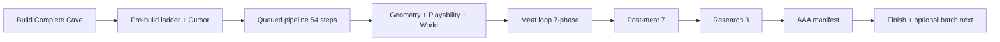

# Session summary — cave build pipeline & respawn (2026-05-21)

> **Archive note (2026-05-27):** This session summary is a point-in-time snapshot. For current behavior and release history, use [CHANGELOG.md](../CHANGELOG.md) and [REQUIREMENTS.md](REQUIREMENTS.md).

Design, implementation, and fixes for the **Environment Authoring Kit** cave automation in a Unity 6 Hub-style project.

Related docs:

- [AAA-PROCEDURAL-CAVE-PIPELINE.md](./AAA-PROCEDURAL-CAVE-PIPELINE.md)
- [CAVE-BUILD-WORKFLOW-HARMONY.md](./CAVE-BUILD-WORKFLOW-HARMONY.md)
- [CaveGradingAndCursor.md](./CaveGradingAndCursor.md)

---

## Project context

XR cave adventure with procedural underground levels, quality grading, Cursor agent integration, and playability gates. Primary entry: **Window → Environment Kit → Build Complete Cave Level**.

Package: `Packages/com.cursor.environment-authoring-kit`.

---

## 1. Unity crashes and infinite loops (fixed)

| Problem | Cause | Fix |
|--------|--------|-----|
| Stack overflow during meat loop / grading | Monolithic `Grade()` + purge in one editor tick | Meat loop split into **7 phases per pass** (purge → 4 grade batches → finalize → fix); deferred `AssetDatabase.Refresh` |
| `compile_gate` infinite loop in pre-build | `PickActiveRung` never returned null; poll + stream both advanced workflow | Ladder-phase guard; `_workflowAdvancedFromStreamFlag` dedupe; regex fix in `CaveBuildCompileGate` |
| Stack overflow after pre-build | Geometry + auto-rebuild scheduled together via `delayCall` | Pacing moved off `delayCall` to editor **update queue**; pre-build geometry flag until build actually finishes |
| 08:47 geometry crash | One huge `Generate()` in a single queue step | Queued pipeline expanded: geometry 11 steps, playability 18, world 11, meat phases, post-meat, research, AAA manifest |

**Coordinator** (`CaveBuildWorkflowCoordinator`): one session tracks phase, preserves walkways after playability, NavMesh bakes once, world scatter once, capped meat prop passes, no post-grade purge undoing walkways.

---

## 2. Meat loop and ground behavior

- **No horizontal cave sliding** during meat loop — only **depth (Y)** mouth→surface snap via `CaveGroundPlacementUtility.TrySnapMouthToSurfaceDepthOnly`; XZ preserved when cave already placed.
- **Enrichment** (`CaveBuildMeatLoopEnrichment`): rotating passes (props, materials/lighting, atmosphere/mobs, polish) instead of only repositioning the cave.
- **Grading** includes terrain/mouth integration; stage fixer uses depth-only snap, not full re-align loops.

---

## 3. Design-doc gaps — implemented

| Gap | Implementation |
|-----|----------------|
| Dedicated research phase | Queued steps **49–51**: `CaveBuildResearchPhase` — catalog refresh → `CaveBuildResearchEnrichment.json` → optional Cursor **research** rung; logs to `CaveBuildResearchPhaseLog.json` |
| Batch mode | `CaveBuildBatchRunner` — N builds, seed increment, delay between jobs; log `CaveBuildBatchLog.json`; menu **Run Batch Cave Builds**; optional `enableBatchMode` on settings |
| AAA 100-point checklist | `CaveBuildAaaFeatureGrader` — 11 features / 100 pts → `CaveBuildAaaFeatureManifest.json`; queued **step 52** |

### Queued pipeline (54 steps)

1. Validate  
2. Geometry **11** (block rings batched)  
3. Playability **18**  
4. World **11**  
5. Meat loop **7-phase** (purge + 4 grade batches + fix)  
6. Post-meat **7**  
7. Research **3**  
8. AAA manifest  
9. Finalize report  

**Settings** (`CaveBuildCursorSettings`):

- `enableBatchMode`, `batchJobCount`, `batchDelaySeconds`, `batchSeedIncrement`
- `runPostBuildResearchPhase`, `invokeCursorOnResearchPhase`

---

## 4. Compile errors resolved

| Error | Fix |
|-------|-----|
| CS0102 duplicate `_workflowAdvancedFromStreamFlag` | Removed duplicate field |
| Regex in `CaveBuildCompileGate` | Valid MSBuild/classic patterns |
| GUILayout invalid state in grader window | Button actions after layout ends |
| CS0122 `RestoreBlockWalls` | Public method with `forGrading` param |
| CS0136 `hub` shadowing in `CaveBuildAaaFeatureGrader` | Single `hubRoot` in `GradeFeature` |
| CS1501 `Invoke` on `Action` in batch runner | `Action<LavaTubeCaveBuildReport>` |
| `StartFromSettings` parameter mismatch | `hideLegacy`, `onBatchComplete` |

---

## 5. Respawn / spawn stuck (play mode)

### Symptom

Portal teleport to cave spawn at roughly **(-14, -110, 94)** (deep underground maze start). Player often had no walkable ground from raycasts or movement stayed locked after warp intro.

### Root causes

- `PlayerGroundSnap` raycasts missed **`SpawnGroundPad`** at deep Y  
- `CaveWarpTransition` / portal could leave **`introActive`** or CharacterController disabled  
- **Shift+R** (`PersistentPlayer`) respawns to surface **`PlayerSpawnPoint`**, not the cave  
- Playability step **Spawn reachability repair** used heavy `AutoFix` (slow during build)

### Fixes

| File | Change |
|------|--------|
| `PlayerGroundSnap.cs` | Prefer **SpawnGroundPad** before generic raycasts |
| `CaveEntranceTeleport.cs` | Pad-top fallback; **UnlockMovement** after teleport |
| `CaveEntrancePortal.cs` | Clear intro lock + unlock movement after teleport |
| `Cave/WarpTransition.cs` | `try/finally` always clears lock; re-teleport if snap fails |
| `PersistentPlayer.cs` | Shift+R also unlocks movement |
| `CaveAdventurePlayabilityPipeline.cs` | Spawn repair = align + pad + floors (not full AutoFix) |
| `CavePlayerMovementFixMenu.cs` | **Respawn Player At Cave Spawn (Play Mode)** menu |

### Play mode recovery

1. Stop Play → **Window → Environment Kit → Fix Cave Player Movement (Active Scene)**  
2. Play → **Respawn Player At Cave Spawn (Play Mode)**  
3. Or **Shift+R** for **surface** respawn (`PlayerSpawnPoint`)  
4. **F** at `MainScene_CavePortal` to re-enter cave  

---

## 6. Generated artifacts

Under `Assets/EnvironmentKit/Generated/`:

| File | Purpose |
|------|---------|
| `CaveBuildQualityReport.json` | Stage rubric scores |
| `CaveBuildGradingManifest.json` | Grading manifest |
| `CaveBuildResearch.json` | Research catalog |
| `CaveBuildResearchEnrichment.json` | Post-build enrichment |
| `CaveBuildResearchPhaseLog.json` | Research phase steps |
| `CaveBuildAaaFeatureManifest.json` | 100-point AAA feature table |
| `CaveBuildBatchLog.json` | Batch run history |
| `CaveBuildWorkflowContext.json` | Agent workflow context |

---

## 7. Operator cheat sheet

### Single cave build

**Window → Environment Kit → Build Complete Cave Level**

Flow: pre-build (optional Cursor) → 54 queued steps → JSON exports → optional post-build Cursor.

### Batch builds

- **Window → Environment Kit → Run Batch Cave Builds (Active Scene)**  
- Or enable **enableBatchMode** in Cave Build Cursor Settings  

### Grading targets

| Gate | Target |
|------|--------|
| Pre-build ladder | ~92+ (`CaveBuildPreBuildLadder.StagePassScore`) |
| Strict build | 99+ / AAA+ (`CaveBuildQualityRubric.MeetsStrictTarget`) |
| AAA feature manifest | 92+ (`CaveBuildAaaFeatureGrader.TargetScore`) |

### If editor build feels stuck

Watch Console for `[CaveBuild]` step labels. Slow steps: meat loop, NavMesh rebake. Spawn reachability repair is now lightweight (no full `AutoFix`).

---

## 8. Architecture



| Design phase | Primary scripts |
|--------------|-----------------|
| Coordinator | `CaveBuildWorkflowCoordinator.cs` |
| Queue / sleep | `CaveBuildActionPacing.cs`, `LavaTubeCaveBuildPipeline.Queued.cs` |
| Pre-build | `CaveBuildPreBuildLadder.cs`, `CaveBuildCursorAgentBridge.cs` |
| Geometry | `CaveAdventureCaveGenerator.QueuedSteps.cs` |
| Playability | `CaveAdventurePlayabilityPipeline.cs` |
| Meat loop | `CaveBuildQualityMeatLoop.Queued.cs`, `CaveBuildMeatLoopEnrichment.cs` |
| Ground / mouth | `CaveGroundPlacementUtility.TrySnapMouthToSurfaceDepthOnly` |
| Research | `CaveBuildResearchPhase.cs` |
| AAA manifest | `CaveBuildAaaFeatureGrader.cs` |
| Batch | `CaveBuildBatchRunner.cs` |
| Spawn / respawn | `PlayerGroundSnap.cs`, `CaveEntranceTeleport.cs`, `CaveSpawnTeleportAuthority.cs` |

---

## 9. Known limits

- Video capture workflow discussed (ffmpeg/screenshots) — not automated in kit  
- Batch menu skips pre-build Cursor for speed  
- **Shift+R** = surface respawn; portal / respawn menu = cave maze start  
- Editor workspace reads can lag disk on some Hub paths — prefer shell when patching  

---

## 10. Key file paths (quick reference)

```
Packages/com.cursor.environment-authoring-kit/
  Editor/Blockout/
    LavaTubeCaveBuildPipeline.cs
    LavaTubeCaveBuildPipeline.Queued.cs
    CaveBuildWorkflowCoordinator.cs
    CaveBuildQualityMeatLoop.Queued.cs
    CaveBuildResearchPhase.cs
    CaveBuildBatchRunner.cs
    CaveBuildAaaFeatureGrader.cs
    CaveAdventurePlayabilityPipeline.cs
  Runtime/Cave/
    PlayerGroundSnap.cs
    CaveEntranceTeleport.cs
    CaveSpawnPadUtility.cs
  docs/
    AAA-PROCEDURAL-CAVE-PIPELINE.md
    CAVE-BUILD-WORKFLOW-HARMONY.md
    SESSION-SUMMARY-2026-05-21.md  (this file)

Assets/Scripts/
  PersistentPlayer.cs
  CaveEntrancePortal.cs
  Cave/CaveWarpTransition.cs
```

---

*Last updated: 2026-05-21*
