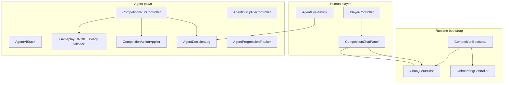

# Hub competition layer — agent game documentation

**Audience:** Class sharing, portfolio reviewers, teammates joining on gameplay (not world generation).

**Scope:** Everything under `Assets/Scripts/Competition/` plus the human demo loop in `Assets/Scripts/` that the agent plugs into. Does **not** cover the Environment Authoring Kit cave/surface pipeline.

**Author:** [JacobForges](https://github.com/JacobForges)

---

## What this is

Hub is a Unity 6 project with two layers:

| Layer | Role |
|-------|------|
| **World** | Procedural Florida karst surface + lava-tube cave (Environment Kit) |
| **Game / competition** | Human explorer + **AI squadmate** — chat commands, ONNX brains, RPG-style stats, onboarding, persistence |

The **playable demo** (see [GAMEPLAY_DEMO_ACCEPTANCE.md](./GAMEPLAY_DEMO_ACCEPTANCE.md)) is: spawn → walk to portal → cave → goal → one combat. The **competition layer** adds a persistent AI agent that trains, follows you, races, and learns from your commands.

Progress tracking:

| File | Meaning |
|------|---------|
| `Assets/Scripts/HubGameProgress.json` | Demo milestones G1–G8 (`demoReady`) |
| `Application.persistentDataPath/Competition/` | Per-agent saves (local disk) |

---

## High-level architecture



**One frame (simplified):**

1. `CompetitionRunController` builds observations (`CompetitionObsBuilder`) — player/goal position, command intent, environment probes.
2. **Gameplay ONNX** (or policy fallback) outputs `CompetitionGameplayActions` (move, jump, attack, …).
3. **Movement authority** is tagged (`AgentMovementAuthority`) — only AI sources may locomote; applier blocks anything else.
4. `CompetitionActionApplier` applies movement, animation, combat.
5. `AgentDecisionLog` records decision + reason; agent eye UI and Command chat can show it.
6. `AgentProgressionTracker` saves XP every ~4 seconds.

---

## First-run onboarding

**Entry:** `CompetitionBootstrap` adds `OnboardingController` when `FirstRunGate.NeedsOnboarding`.

**Flow:**

1. **12-step wizard** — name, build, height, style, color, kit, race/jump/stuck/risk/focus/fall traits (`OnboardingController` + `OnboardingWizardUi`).
2. **Setup ONNX** — encodes choices → archetype + avatar vector (`CompetitionSetupBrain`).
3. **Avatar pick** — three catalog looks + “Surprise me”; click to **preview only**, **Continue** to proceed (`SelectAvatar` → character sheet).
4. **Character sheet** — D&amp;D-style review; confirm creates first agent (`CompetitionAgentRegistry.CreateAgent`).

**Key files:**

| File | Role |
|------|------|
| `Onboarding/OnboardingController.cs` | Wizard logic |
| `UI/OnboardingWizardUi.cs` | Layout, avatar grid, tabs |
| `UI/OnboardingPreviewStage.cs` | Off-screen 3D preview + thumbnails |
| `UI/AgentCharacterSheetUi.cs` | Confirm sheet before persist |
| `Onboarding/AgentCharacterSheetGenerator.cs` | Sheet stats from session |

---

## Agent pawn lifecycle

**Spawn:** `CompetitionAgentSpawner.TrySpawnNearPlayer()` beside the human player after onboarding.

**Components wired by `AgentAiStack.EnsureOn`:**

| Component | Purpose |
|-----------|---------|
| `CompetitionRunController` | ONNX tick loop, training samples |
| `CompetitionActionApplier` | Physics + movement authority gate |
| `AgentBehaviorController` | Modes: Explore, Train, Battle, Race, Rest |
| `AgentCommandState` | Timed commands: Follow, Hold, Rush, … |
| `AgentEnvironmentSense` | Forward/cliff probes → observations |
| `AgentDisciplineController` | INT penalties + WIS follow rewards |
| `AgentDecisionLog` | Decision broadcast / eye UI |
| `AgentProgressionTracker` | 7-stat XP, levels, save |
| `CompetitionAvatarVisual` | Humanoid mesh from catalog |
| `AgentLocomotionAnimator` | Idle / run / jump clips |

**Visuals:** Kenney humanoid via `Competition/AgentLocomotion` controller — not a grey capsule.

---

## AI movement (brain-owned locomotion)

Design rule: **no scripted default movement.** The agent only moves when an AI authority allows it.

### Authority types (`AgentMovementAuthority`)

| Authority | Can move? | Meaning |
|-----------|-----------|---------|
| `GameplayOnnx` | Yes | Fresh 15 Hz ONNX tick |
| `GameplayOnnxHold` | Yes | Holding last ONNX output between ticks |
| `PolicyOnnx` | Yes | Fallback policy network |
| `AdapterRefined` | Yes | Per-agent adapter blend (practice mode) |
| `MlAgentsTrain` | Yes | ML-Agents training bridge |
| `CommandRest` / `CommandHold` | No | Explicit stop |
| `IdleNoBrain` | No | No model loaded |
| `WatchReplay` | N/A | Watch & Learn replay (direct CC move) |
| `ViolationBlocked` | No | Non-AI movement rejected |

**Removed / disabled paths:** heuristic walk-to-goal, follow vector injection in applier, behavior steering toward goals, navigation assist overrides.

**Follow command:** Observations point goal at the player + command encoded in obs slots 2–3. The brain must choose to move — not a script.

**Fail-safe:** `CompetitionActionApplier.EnforceMovementAuthority` zeros locomotion and `AgentDecisionLog.RecordViolation` if something tries to move without AI authority.

### Decision transparency

| UI | Location | Shows |
|----|----------|-------|
| **Agent eye fullscreen** | Bottom-right PiP → expand | Live preview + **Decision broadcast** panel (authority, action, reason, history) |
| **Command chat** | Throttled agent lines | “Why I did this” when AI decision changes |

**Key files:** `AgentDecisionLog.cs`, `AgentEyeDecisionHud.cs`, `AgentEyeViewUi.cs`, `CompetitionRunController.cs`, `CompetitionActionApplier.cs`.

---

## Discipline & progression

### Seven stats (`AgentStatAxis`)

Speed, Strength, Dexterity, Constitution, **Intelligence**, **Wisdom**, Charisma.

XP lives on the **agent profile**, not the human player. Saved in `profile.json` under each agent folder.

### Intelligence penalties (`AgentDisciplineController`)

| Trigger | Effect |
|---------|--------|
| Follow active, still **>3 m** from player | **−3.5 INT** every **30 s** |
| Jump without valid reason (obstacle, gap, train mode, race cliff) | **−2.5 INT** per jump |

Valid jumps checked by `AgentJumpValidator` (environment sense + forward wall raycast).

### Wisdom rewards (follow arrival)

When the agent reaches you (~3 m) after **Follow**:

| Time since follow started | Wisdom XP |
|---------------------------|-----------|
| **< 45 s** | None (INT penalties may still apply while catching up) |
| **45 s – < 60 s** | **19** (14 + 5 bonus) |
| **60 s – 90 s** | **14** |
| **> 90 s** on arrival | None |

One wisdom award per follow session.

### Passive gains

`AgentProgressionTracker` also grants XP from movement, jumps, combat, defending, passive INT drip, training samples.

**API:** `PenalizeIntelligence`, `GrantWisdom`, `AdjustXp` on `AgentProgressionTracker`.

---

## Chat system

### Routing model

| You type | Goes to |
|----------|---------|
| Plain text (default) | **Your agent** — commands, casual chat, natural language |
| `@` + message | **Global** — everyone in the session |

Agent chat is a **direct line** (no `@` bridge). Use `@` only when you want session-wide broadcast.

### Channels (`ChatChannel`)

| Channel | Tag | Tab | Meaning |
|---------|-----|-----|---------|
| Global | `[G]` | **Chat** | Lines prefixed with `@` |
| Proximity | `[L]` | **Chat** | Nearby overheard talk |
| Command | `[A]` | **Chat** | Direct owner → agent lines |
| System | `[S]` | **System** | Game / stat messages |

### Chat panel tabs (`CompetitionChatPanel`)

- **Chat** — agent replies, global `@` lines, proximity.
- **System** — spawn messages, discipline, errors, **stat XP / level-ups** (`PostAgentStatLine`).

Open chat: **T** or **Enter** (when not in agent eye fullscreen). **Esc** closes input. Placeholder: *Talk to your agent · @ for global*.

### Commands (type in chat — no `@`)

Full list in `AgentCommandHelp.Body`. Examples:

```
help
follow
explore
train
battle aggressive
race map
rest
hold
course
```

Global example: `@ hello everyone`

Natural language also routes through personality + intent ONNX for the owner.

**Key files:** `ChatQueueHost.cs`, `CompetitionChatPanel.cs`, `AgentCommandParser.cs`, `AgentPersonalityChatRouter.cs`.

---

## Agent eye UI

| Control | Action |
|---------|--------|
| PiP (bottom-right) | Click → fullscreen agent first-person view |
| Command strip | Explore, Train, Battle, Race, Follow, Hold, Rest, … |
| Record | Loop record agent eye until Stop |
| Left panel | RPG stats |
| Right panel | **Decision broadcast** (AI movement vs idle, reason, history) |
| XP toasts | Floating stat gains in fullscreen |

**Key files:** `AgentEyeViewUi.cs`, `AgentEyeCamera.cs`, `AgentEyeRecorder.cs`, `AgentProgressionDisplay.cs`.

---

## Watch & Learn

1. Compass HUD → **Watch & Learn** — agent follows and records your movement samples.
2. Say **“you try”** in chat — agent replays demo waypoints (separate from ONNX; labeled `WatchReplay`).
3. Success/failure updates ledger + knowledge facts.

**File:** `Agents/AgentWatchLearnController.cs`.

---

## Persistence

**Root:** `Application.persistentDataPath/Competition/`

| Path | Content |
|------|---------|
| `player_profile.json` | Human name, active agent id, onboarding flags |
| `Agents/{agentId}/profile.json` | Agent name, avatar, **progression XP**, character sheet |
| `Agents/{agentId}/ledger.json` | Mood, strikes, rewards |
| `Agents/{agentId}/knowledge.jsonl` | Long-term memory facts |
| `Agents/{agentId}/dataset/` | Training episodes |
| `Agents/{agentId}/models/` | Per-agent adapter ONNX |

**Save cadence:** ~4 s while agent active + on destroy. Atomic write (`.tmp` → rename).

**Delete agent:** Roster UI or `CompetitionAgentRegistry.DeleteAgent` — wipes folder.

**Optional cloud:** `CompetitionCloudPersistence` (Unity Gaming Services) uploads on save; restores on sign-in if cloud XP ≥ local.

---

## Module map (`Assets/Scripts/Competition/`)

| Folder | Responsibility |
|--------|----------------|
| **Core/** | Profiles, paths, registry, bootstrap, first-run gate |
| **Onboarding/** | Wizard controller, character sheet generation |
| **Agents/** | Spawner, pawn, locomotion animator, watch & learn, fall vitality |
| **Brains/** | ONNX brains, action applier, behavior, commands, discipline, decision log, jump validator |
| **Chat/** | Queue, panel, command parser, personality router, dialogue |
| **UI/** | Onboarding UI, agent eye, compass HUD, roster, race map |
| **Progression/** | XP state, level math, display |
| **Run/** | Run controller, ledger, episode writer, punishment debuff |
| **Avatars/** | Catalog, visual attach |
| **Encoding/** | Obs builder, feature encoder |
| **Multiplayer/** | Network pawn sync (owner simulates, peers replicate) |
| **Training/** | Adapter dataset + trainer |
| **Cloud/** | UGS cloud save queue |

**Human demo scripts (outside Competition folder):** `Assets/Scripts/PlayerController.cs`, `CombatStats.cs`, `MainSceneGameplaySetup.cs`, `HubGameProgress.json`, etc.

---

## How to run (class demo script)

1. Open Hub in Unity 6, load **MainScene** (local).
2. Enter **Play Mode**.
3. Complete **onboarding** if first run (or delete `Competition/` under persistent data to reset).
4. Walk surface → **PortalFive** → cave goal (demo path).
5. Open **chat (T)** → `follow` — watch **System** tab for INT/WIS messages.
6. Expand **agent eye** — confirm **AI MOVEMENT** badge and decision reasons.
7. Try **Watch & Learn** + “you try” for imitation.

**Compile gate:** Project must compile with no CS errors (e.g. no C# 9 `init` on older Unity language version — `AgentDecisionLog.Entry` uses a constructor).

**Demo milestone exit:** After manual smoke pass, set `HubGameProgress.json` → `"demoReady": true` (G8). See [GAMEPLAY_DEMO_ACCEPTANCE.md](./GAMEPLAY_DEMO_ACCEPTANCE.md).

---

## Related docs

| Doc | Topic |
|-----|--------|
| [GAMEPLAY_DEMO_ACCEPTANCE.md](./GAMEPLAY_DEMO_ACCEPTANCE.md) | Demo smoke checklist |
| [CURSOR_BOT_PHASED_MISSION.md](./CURSOR_BOT_PHASED_MISSION.md) | Bot phases (world vs gameplay) — reference only |
| [GLOSSARY.md](./GLOSSARY.md) | Hub vs kit naming |

---

## Glossary (competition-specific)

| Term | Meaning |
|------|---------|
| **Agent / pawn** | AI squadmate `CompetitionAgentPawn` |
| **ONNX brain** | `competition_gameplay.onnx` — 96-dim obs → 12-dim actions |
| **Archetype** | sprinter, steady, explorer, … — from setup ONNX |
| **Ledger** | Reward/strike/mood memory for dialogue |
| **Command intent** | Follow, Hold, Rush, … — timed overrides on `AgentCommandState` |
| **Authority** | Who is allowed to drive movement this frame |

---

*Last updated: 2026-06-08 — chat routing: direct agent (no `@`), global broadcast with `@`; movement authority, discipline, chat tabs, onboarding avatar pick, decision UI.*
