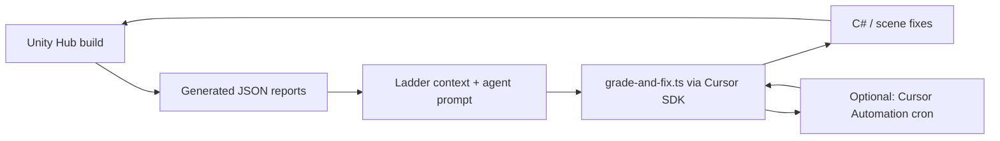

# Cursor bot architecture — Hub project

**Goal:** A bot that systematically finishes **Phase 1 world pipeline → Phase 2 playable demo → Phase 3 polish** — not magic unattended AAA ship.

See [CURSOR_BOT_PHASED_MISSION.md](./CURSOR_BOT_PHASED_MISSION.md) for routing rules.

## Recommended stack: SDK + rules/skills + optional Automations

| Layer | Role | Why for Hub |
|-------|------|-------------|
| **Cursor SDK** (`cave-grader`) | Headless agent runs against `HUB_ROOT` | Already built: `grade-and-fix.ts`, `watch-grade.ts`, heal checkpoints, ladder prompts |
| **Project rules/skills** | `AGENTS.md`, `hub-game-completion` skill | Keeps agents on one-rung fixes and JSON-truth contract |
| **Cursor Automations** | Scheduled or git-triggered IDE agents | Good for daily “pick next backlog item” when Unity editor is open on the Mac |
| **GitHub Actions** | Headless Unity showcase nightly | Exists (`environment-kit-showcase-nightly.yml`) but needs self-hosted Unity — not the primary dev loop |

**Not recommended alone:** Automations without SDK — IDE automations cannot drive Unity headless. **Not recommended alone:** SDK without Unity — agents can edit C# but cannot re-grade without editor or batch runner.

## Data flow

## Runtime modes

### Local SDK (primary)

- **Requires:** Cursor desktop app signed in, `CURSOR_API_KEY` in `Packages/com.cursor.environment-authoring-kit/Tools/cave-grader/.env`, Node 18+.
- **Command:** `./Tools/cursor-bot/run-session.sh --stream`
- **Routing:** Auto — `mission-phase.ts` picks `post_build` (world) or `gameplay` from quality report + `HubGameProgress.json`.
- **Model:** `CAVE_CURSOR_MODEL=auto` or explicit id from `npm run doctor`.

### Cloud SDK (fallback)

- Set `CAVE_CURSOR_REPO_URL` to pushed Hub remote.
- `./run-grade-and-fix.sh --cloud --stream` when local executor fails.

### Cursor Automation (supplement)

Draft: [Tools/cursor-bot/automation-draft.json](../Tools/cursor-bot/automation-draft.json)

Suggested trigger: **weekdays 9am** cron or **manual webhook** after Unity re-grade exports new `CaveBuildAgentPrompt.md`.

Automation prompt should: read `AGENTS.md`, read active rung JSON, fix one item, **not** run full cave build.

### Unity headless (CI only)

- `run-showcase-headless.sh` on self-hosted runner with `UNITY_PATH`.
- Blocker: GitHub-hosted runners have no Unity license/GPU; nightly workflow expects `vars.UNITY_PATH` on a custom runner.

## Credentials checklist

| Secret | Where | Needed for |
|--------|-------|------------|
| `CURSOR_API_KEY` | `Packages/com.cursor.environment-authoring-kit/Tools/cave-grader/.env` | SDK local + cloud |
| `HUB_ROOT` | `.env` | Points SDK at `/Users/jacob/Hub` |
| Unity license | Local machine | Editor builds & re-grade |
| `CAVE_CURSOR_REPO_URL` | `.env` optional | Cloud fallback |

## Human-in-the-loop gates

1. **Full AAA Rebuild** — destructive; human confirms.
2. **Allow external provider edits** — off by default in Hub settings.
3. **Play mode playtest** — XR/device QA cannot be automated without hardware.

## Files added by this scaffold

| File | Purpose |
|------|---------|
| `AGENTS.md` | Agent entrypoint |
| `.cursor/skills/hub-game-completion/SKILL.md` | Phase 1 world sessions |
| `.cursor/skills/hub-gameplay-completion/SKILL.md` | Phase 2 demo sessions |
| `Assets/Scripts/HubGameProgress.json` | Gameplay milestone tracker |
| `docs/GAMEPLAY_DEMO_ACCEPTANCE.md` | Playable demo criteria |
| `docs/CURSOR_BOT_PHASED_MISSION.md` | Phase routing |
| `docs/CURSOR_BOT_BACKLOG.md` | Prioritized work streams |
| `Tools/cursor-bot/run-session.sh` | One-command SDK session |
| `Tools/cursor-bot/automation-draft.json` | Editor prefill for Cursor Automation |
